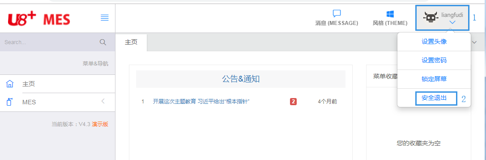

# 概述

## 文档目的

瑞联智造 MES(PC)
V3.0 操作手册，给予用户准确、明晰、简介的系统使用指导和说明，能够帮助用户快速理解 MES 管理系统。

## 总体业务流程

## MES3.0 登录

### 3.1 系统管理员登录和退出

- **系统管理员登录操作**

打开打开 google 浏览器中输入 mes3.0
的 IP 地址和端口或域名和端口，打开 mes3.0。在登陆界面输入 system，密码为\*\*\*\*\*\*，点击登录进入 mes3.0，这个用户用来设置增加用户、角色、权限、系统设置等信息。

- **操作说明（参照上图）**

1. 录入 mes3.0 的 IP 地址与端口，对应操作“1”；

2. 录入 mes3.0 默认管理员用户 system，对应操作“2”；

3. 录入 mes3.0 已经设置的密码\*\*\*\*\*，对应操作“3”；

4. 登陆的日期，可以修改，对应操作“4”；F

5. 选择账套，对应操作“5”；

6. 点击“登陆”，进入 mes3.0 系统。

- **系统管理员退出操作：**

- **操作说明（参照上图）**

1. 点击右上角，打开个人设置，对应操作“1”；

2. 点击“安全退出”，对应操作“2”。

### 3.2 普通用户登录和退出

#### 3.2.1 用户登录操作说明

- **操作说明（参照上图）**

1. 录入 mes3.0 的 IP 地址与端口，对应操作“1”；

2. 录入 mes3.0 已经设置的用户编码，对应操作“2”；

3. 录入 mes3.0 已经设置的密码，对应操作“3”；

4. 登陆的日期，可以修改，对应操作“4”；

5. 选择账套，对应操作“5”；

6. 点击“登录”，进入 mes3.0 系统。

#### 3.2.2 用户退出操作说明

- **操作说明（参照上图）：**

1. 点击右上角的个人设置图像，对应操作“1”；

2. 点击“安全退出”，对应操作“5”

#### 3.2.3 用户设置头像操作说明

本操作用来设置改变右上边用户的显示图像。

- **操作说明（参照上图）**

> 1、点击右上角的个人设置图像，对应操作“1”；
> 2、点击“设置图像”，对应操作“2”；

#### 3.2.4 用户设置密码操作说明

本操作用来变更用户的密码

- **操作说明（参照上图）**

1. 点击右上角的个人设置图像，对应操作“1”；

2. 点击“设置密码”，对应操作“3”；

3. 在弹出的新窗口中录入“当前密码”，“新密码”，“确认密码”和“验证码”，然后点击“保存”。

#### 3.2.5 用户锁定屏幕操作说明

本操作用来不退出 MES 系统，锁定 MES 的操作界面

- **操作说明（参照上图）**

1. 点击右上角的个人设置图像，对应操作“1”；

2. 点击“锁定屏幕”，对应操作“4”。

## 风格

- **“风格”的功能和界面。**

“风格”的作用就是设置界面显示的格式，比如：背景颜色、菜单文本的颜色、菜单背景的颜色等等,每个用户可以根据自己的喜好，设置自己喜欢的风格。

- **“风格”的操作：**

1. 点击“风格”，对应操作“1”；

2. 选择对应的风格，对应的操作“2-7”。

- **“风格”的样式：**

1. “风格”是蓝字白底，对应操作“2”；

1. “风格”黑橘白，对应操作“3”；

1. “风格”是灰青白，对应操作“4”；

1. “风格”是白蓝黑，对应操作“5”；

1. “风格”是黑青白，对应操作“6”；

1. “风格”是黑白，对应操作“7”。

