# 概述

## 文档目的

瑞联智造 MES(PC)
V3.0 操作手册，给予用户准确、明晰、简介的系统使用指导和说明，能够帮助用户快速理解 MES 管理系统。

## 总体业务流程

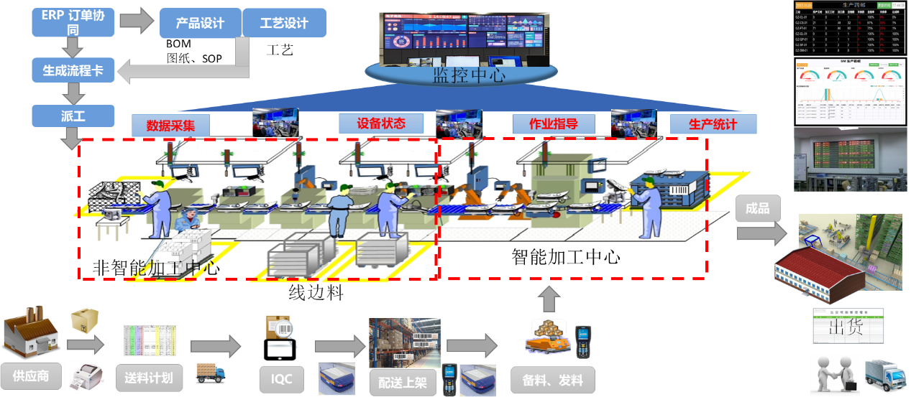

## MES3.0 登录

### 3.1 系统管理员登录和退出

- **系统管理员登录操作**

打开打开 google 浏览器中输入 mes3.0
的 IP 地址和端口或域名和端口，打开 mes3.0。在登陆界面输入 system，密码为\*\*\*\*\*\*，点击登录进入 mes3.0，这个用户用来设置增加用户、角色、权限、系统设置等信息。

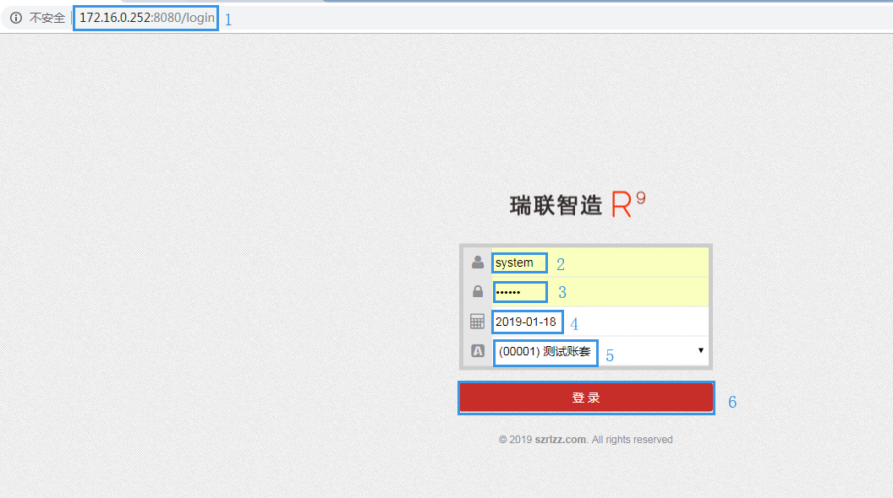

- **操作说明（参照上图）**

1. 录入 mes3.0 的 IP 地址与端口，对应操作“1”；

2. 录入 mes3.0 默认管理员用户 system，对应操作“2”；

3. 录入 mes3.0 已经设置的密码\*\*\*\*\*，对应操作“3”；

4. 登陆的日期，可以修改，对应操作“4”；F

5. 选择账套，对应操作“5”；

6. 点击“登陆”，进入 mes3.0 系统。

- **系统管理员退出操作：**

- **操作说明（参照上图）**

1. 点击右上角，打开个人设置，对应操作“1”；

2. 点击“安全退出”，对应操作“2”。

### 3.2 普通用户登录和退出

#### 3.2.1 用户登录操作说明

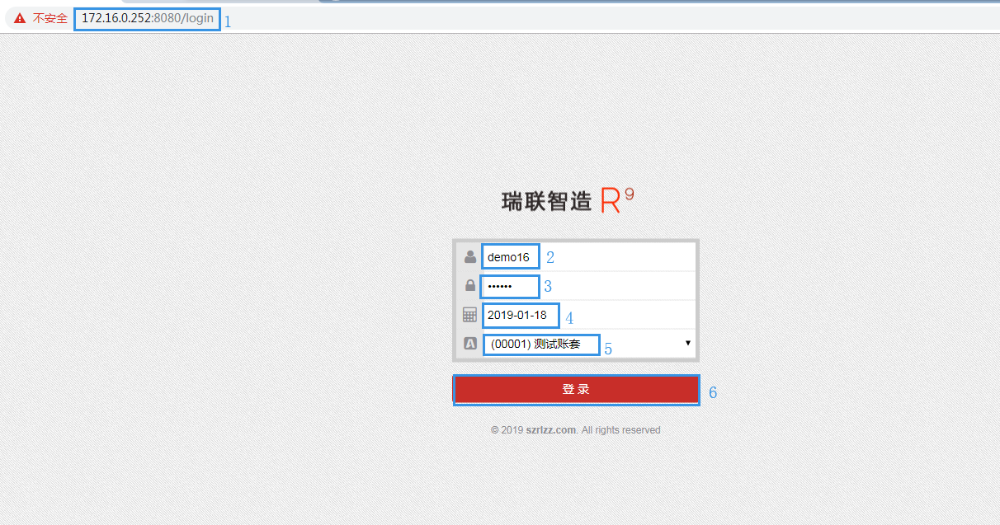

- **操作说明（参照上图）**

1. 录入 mes3.0 的 IP 地址与端口，对应操作“1”；

2. 录入 mes3.0 已经设置的用户编码，对应操作“2”；

3. 录入 mes3.0 已经设置的密码，对应操作“3”；

4. 登陆的日期，可以修改，对应操作“4”；

5. 选择账套，对应操作“5”；

6. 点击“登录”，进入 mes3.0 系统。

#### 3.2.2 用户退出操作说明

- **操作说明（参照上图）：**

1. 点击右上角的个人设置图像，对应操作“1”；

2. 点击“安全退出”，对应操作“5”

#### 3.2.3 用户设置头像操作说明

本操作用来设置改变右上边用户的显示图像。

- **操作说明（参照上图）**

> 1、点击右上角的个人设置图像，对应操作“1”；
> 2、点击“设置图像”，对应操作“2”；

#### 3.2.4 用户设置密码操作说明

本操作用来变更用户的密码

- **操作说明（参照上图）**

1. 点击右上角的个人设置图像，对应操作“1”；

2. 点击“设置密码”，对应操作“3”；

3. 在弹出的新窗口中录入“当前密码”，“新密码”，“确认密码”和“验证码”，然后点击“保存”。

#### 3.2.5 用户锁定屏幕操作说明

本操作用来不退出 MES 系统，锁定 MES 的操作界面

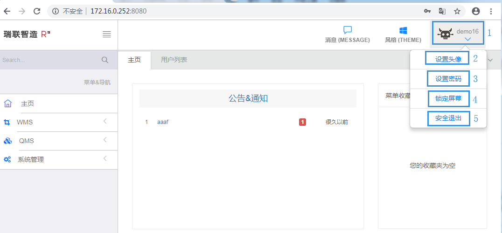

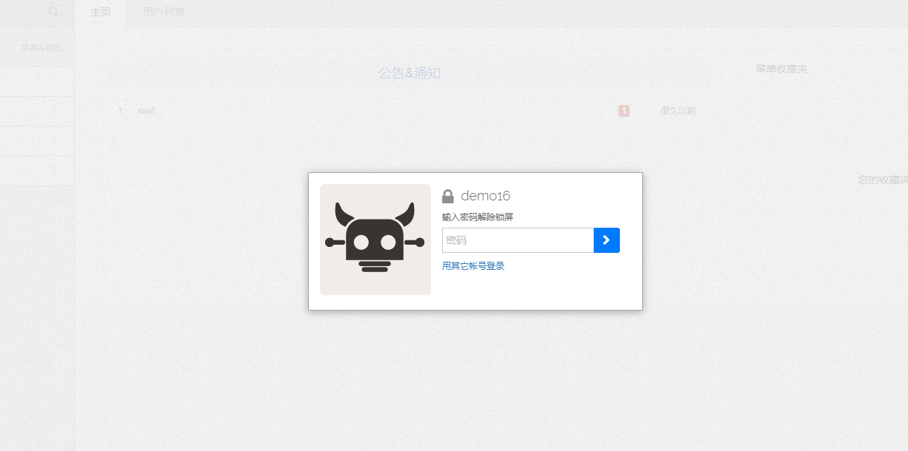

- **操作说明（参照上图）**

1. 点击右上角的个人设置图像，对应操作“1”；

2. 点击“锁定屏幕”，对应操作“4”。

## 风格

- **“风格”的功能和界面。**

“风格”的作用就是设置界面显示的格式，比如：背景颜色、菜单文本的颜色、菜单背景的颜色等等,每个用户可以根据自己的喜好，设置自己喜欢的风格。

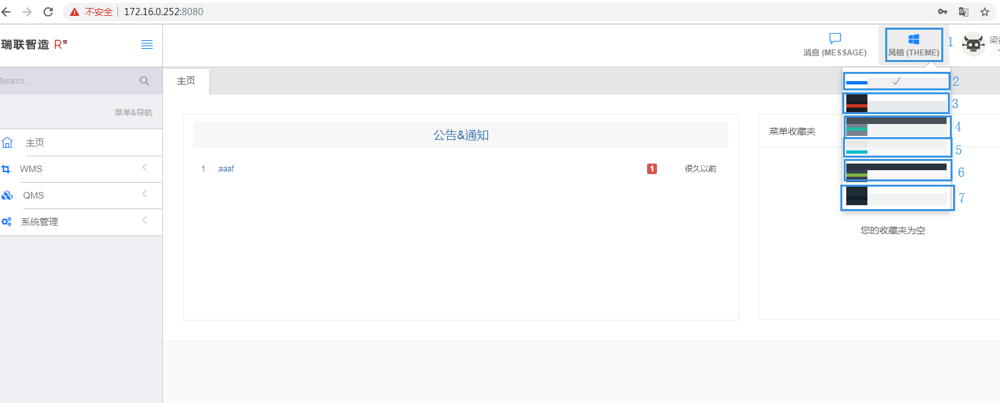

- **“风格”的操作：**

1. 点击“风格”，对应操作“1”；

2. 选择对应的风格，对应的操作“2-7”。

- **“风格”的样式：**

1. “风格”是蓝字白底，对应操作“2”；

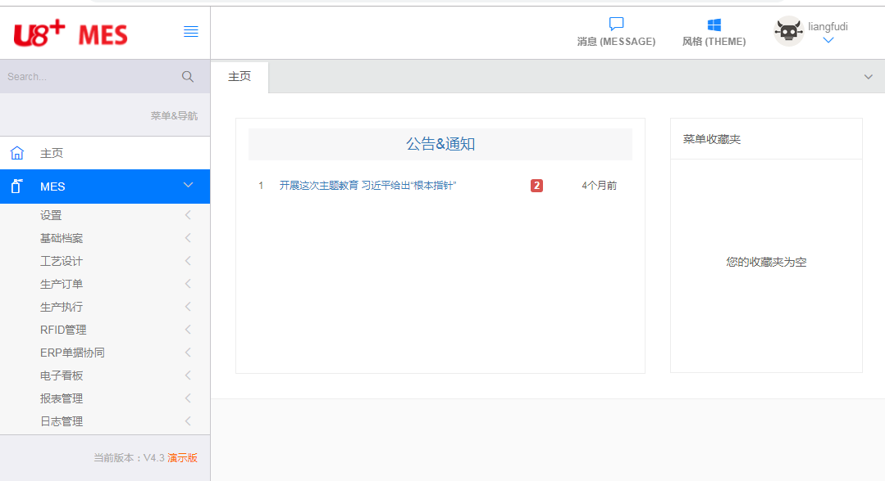

1. “风格”黑橘白，对应操作“3”；

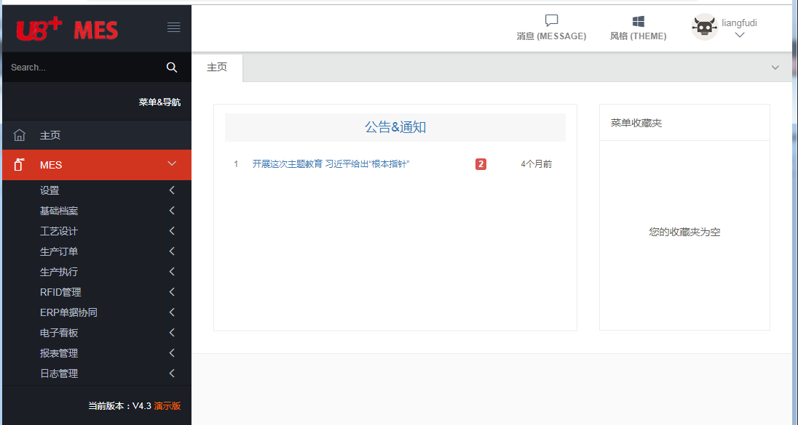

1. “风格”是灰青白，对应操作“4”；

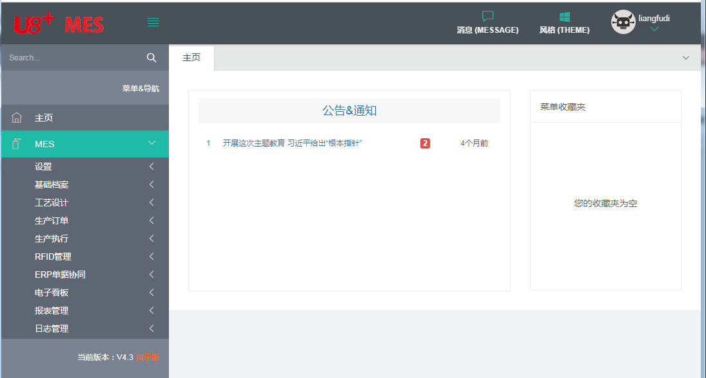

1. “风格”是白蓝黑，对应操作“5”；

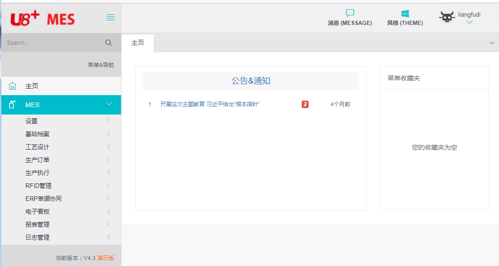

1. “风格”是黑青白，对应操作“6”；

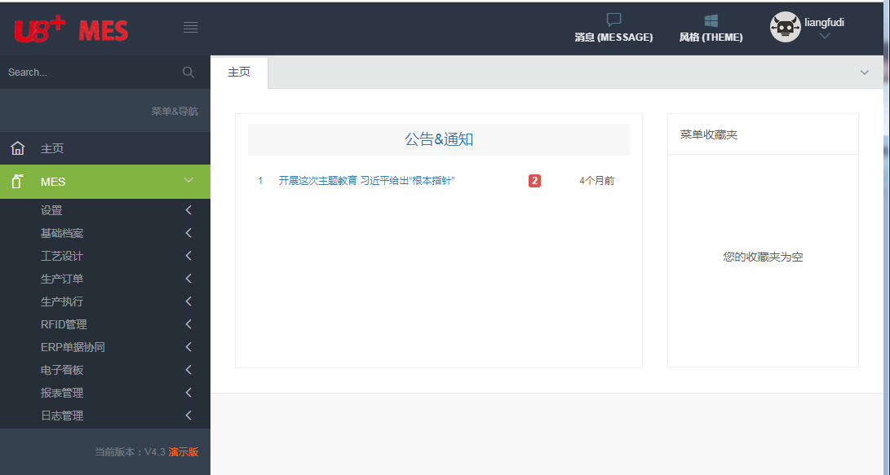

1. “风格”是黑白，对应操作“7”。

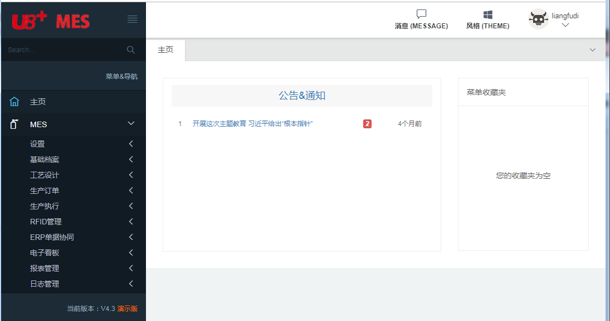

1. MES

   1. 设置

      1. 生产执行设置

- **菜单路径**

登录 mes3.0—MES—设置—生产执行设置

- **概述**

生产执行过程的工站报工配置、日期配置和流程卡配置

- **操作界面**

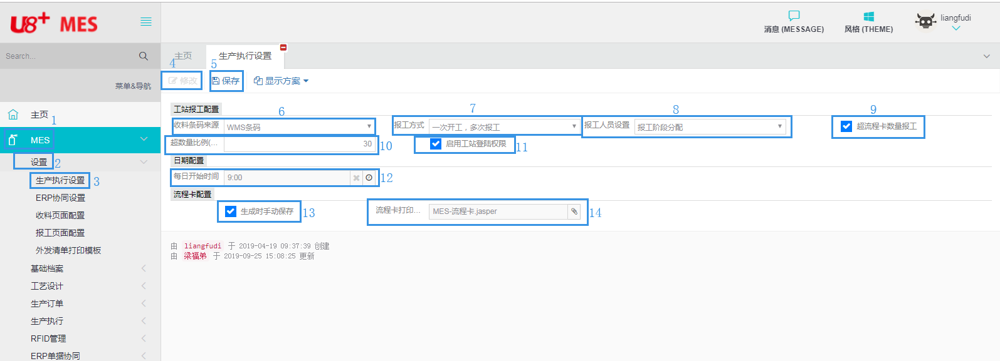

- **操作说明（参照上图）**

1. 点击“MES”,点击“设置”，点击“生产执行设置”，进入生产执行设置操作页面；

2. 工站报工配置，收料条码来源可以选择“WMS 条码”、“U8 条码”，默认选择“WMS 条码”，对应操作是“6”，选择好条码来源后，工站收料时，收相应的来源条码，否则有提示；

3. 工站报工配置，报工方式有两种“一次开工，多次报工”、“一次开工、一次报工”，默认选择“一次开工，一次报工”的方式，对应操作是“7”；

4. 工站报工配置，报工人员设置“开工阶段分配”、“报工阶段分配”，对应操作是“8”；当报工方式是“一次开工，多次报工”时，报工人员设置选择“开工阶段分配”时，保存不成功，会有对应的提示；

5. 工站报工配置，可以勾选“超流程卡数量报工”，根据输入的“超数量比例(%)”，填写了超流程卡报工比例，允许超订单报工，但是要在比例内，允许报工数
   = 流程卡数量\*((100+超流程卡报工比例)/100)，对应操作是“9”、“10”；

6. 工站报工配置，可以勾选“启用工站登陆权限”，对应操作是“11”；勾选启用后，要在人员工站绑定页面，给人员分配工序的权限；

7. 日期配置“每日开始时间”，生产执行过程中的一天从什么时候开始，24 小时后结束后属于第二天，对应操作是“12”

8. 流程卡配置，可以勾选“生成时手动保存”勾选表示，点击生成流程卡时，要手动点击保存生成流程卡，否则在点击生成流程卡时自动保存生成流程卡，对应操作是“13”；

9. 流程卡配置，上传“流程卡打印模板”，对应操作是“14”；

10. 修改生产执行设置时，点击“修改”，对应操作“4”；

11. 保存生产执行设置时，点击“保存”，对应操作“5”。

    1. ERP 协同设置

- **菜单路径**

登录 mes3.0—MES—设置—ERP 协同设置

- **概述**

配置 MES 生成 ERP 材料出库单和 MES 生成 ERP 产成品入库单参数。

- **操作界面**

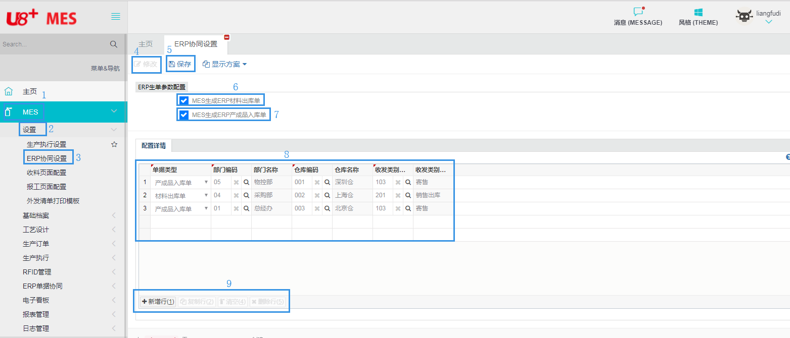

- **操作说明（参照上图）**

1. 点击“MES”,点击“设置”，点击“ERP 协同设置”，进入 ERP 协同设置操作页面；

2. ERP 生单参数配置，勾选“MES 生成 ERP 材料出库单”，勾选了才可以在 MES 系统做 ERP 材料出库单，对应操作是“6”；

3. ERP 生单参数配置，勾选“MES 生成 ERP 产成品入库单”，勾选了才可以在 MES 系统做 ERP 产成品入库单，对应操作是“7”；

4. 配置详情，选择单据类型、部门编码、部门名称、仓库编码、仓库名称、收发类别编码、收发类别名称，保存配置，方便做 ERP 材料出库单或 ERP 产成品入库单时，选择部门带出其它参数，对应操作是“8”

5. 配置详情表体的操作有新增行、复制行、清空、删除行，对应操作是“9”；

6. 修改 ERP 协同设置时，点击“修改”，对应操作是“4”；

7. 保存 ERP 协同设置时，点击“保存”，对应操作是“5”。

   1. 收料页面配置

- **菜单路径**

登录 mes3.0—MES—设置—收料页面配置

- **概述**

配置每个工序在工站收料页面的自定项，自定项参照 U8 生产订单的表头和表体的自定义项

- **操作界面**

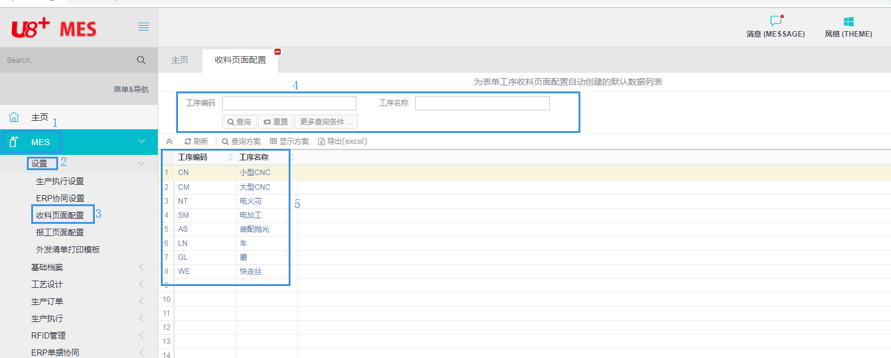

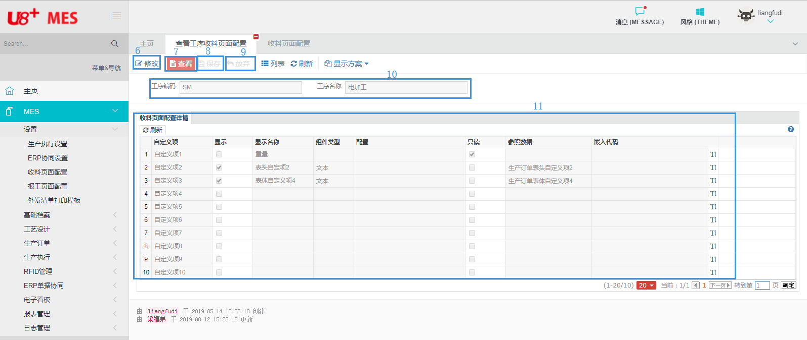

- **操作说明（参照上图）**

1. 点击“MES”,点击“设置”，点击“收料页面配置”，进入收料页面配置操作页面；

2. 收料页面配置页显示所有工序，可以查询工序，对应操作是“4”；

3. 收料页面配置页，点击工序编码或工序名称进入查看工序收料页面配置，对应操作是“5”、和操作“7”；

4. 查看工序收料页面配置页，显示要配置的工序编码和工序名称，对应操作“10”；

5. 查看工序收料页面配置页，在收料页面配置详情表体配置工序的自定义项，对应操作是“11”；

6. 修改工序收料页面配置，点击“修改”，对应操作是“6”；

7. 保存工序收料页面配置，点击“保存”，对应操作是“8”；

8. 放弃保存工序收料页面配置，点击“放弃”，对应操作是“9”；

   1. 报工页面配置

- **菜单路径**

登录 mes3.0—MES—设置—报工页面配置

- **概述**

配置每个工序在工站报工页面的自定项，自定项参照 U8 生产订单的表头和表体的自定义项

- **操作界面**

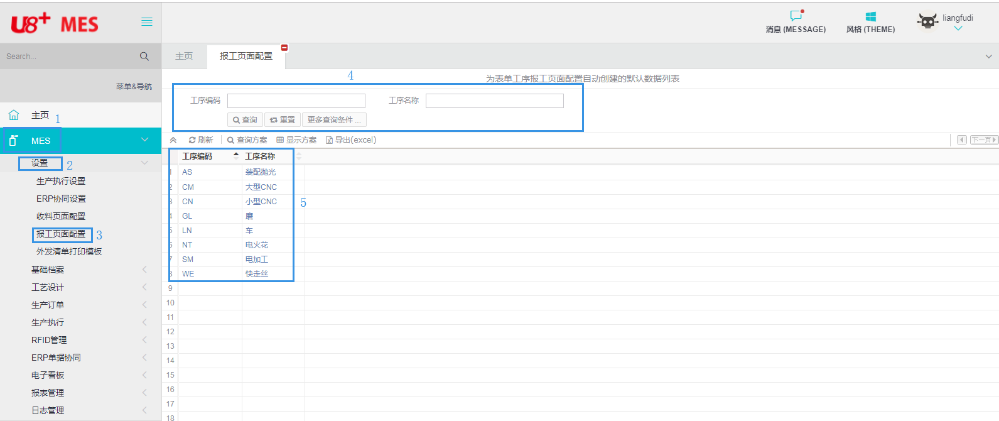

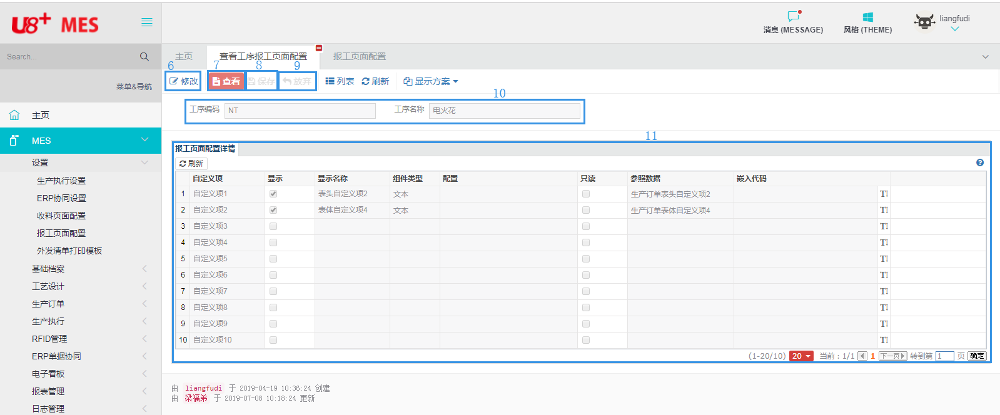

- **操作说明（参照上图）**

1. 点击“MES”,点击“设置”，点击“报工页面配置”，进入报工页面配置操作页面；

2、报工页面配置页显示所有工序，可以查询工序，对应操作是“4”；

3、报工页面配置页，点击工序编码或工序名称进入查看工序报工页面配置，对应操作是“5”、和操作“7”；

4、查看工序报工页面配置页，显示要配置的工序编码和工序名称，对应操作“10”；

5、查看工序报工页面配置页，在报工页面配置详情表体配置工序的自定义项，对应操作是“11”；

6、修改工序报工页面配置，点击“修改”，对应操作是“6”；

7、保存工序报工页面配置，点击“保存”，对应操作是“8”；

8、放弃保存工序报工页面配置，点击“放弃”，对应操作是“9”；

### 外发清单打印模板

- **菜单路径**

登录 mes3.0—MES—设置—外发清单打印模板

- **概述**

配置外发清单的打印模板

- **操作界面**

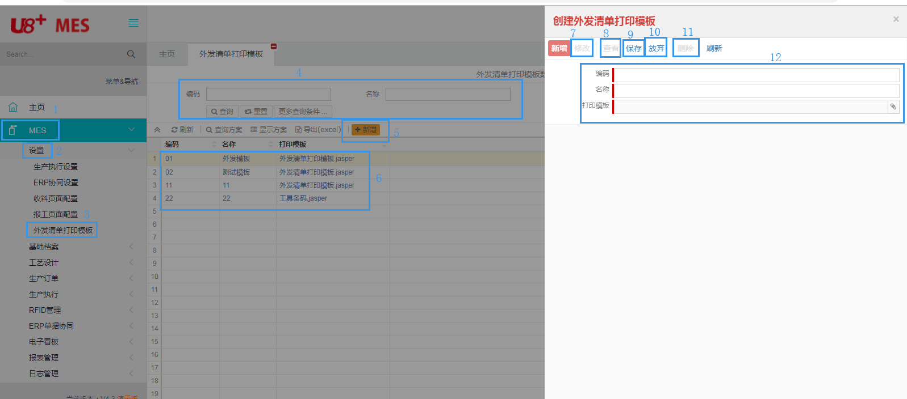

- **操作说明（参照上图）**

1. 点击“MES”,点击“设置”，点击“外发清单打印模板”，进入外发清单打印模板页面；

2. 外发清单打印模板页，可以查询外发清单打印模板，对应操作是“4”；

3. 外发清单打印模板页，点击“新增”，弹出新增外发清单打印模板页，对应操作是“5”；

4. 外发清单打印模板页，点击“编码”、名称，弹出外发清单打印模板详情页，点击“打印模板”弹出可以下载的模板，对应操作是“6”；

5. 外发清单打印模板新增/详情页，点击“修改”，修改外发清单打印模板名称和打印模板，对应操作是“7”；

6. 外发清单打印模板新增/详情页，点击“保存”，保存外发清单打印模板，对应操作是“8”；

7. 外发清单打印模板新增/详情页，点击“放弃”，放弃保存外发清单打印模板，对应操作是“9”；

8. 外发清单打印模板新增/详情页，点击“删除”删除外发清单打印模板，对应操作是“10”；

9. 外发清单打印模板新增/详情页，输入外发清单打印模板的编码、名称和上传打印模板，对应操作是“11”。

   1. 基础档案

      1. 工作日历

- **菜单路径**

登录 mes3.0—MES—基础档案—工作日历

- **概述**

配置工作的日历，设置工作日，设置起止日期、设置工时

- **操作界面**

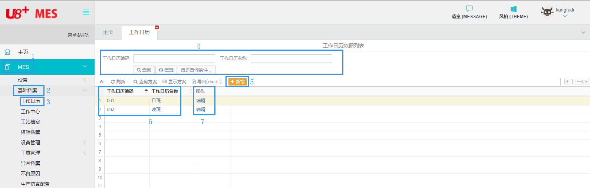

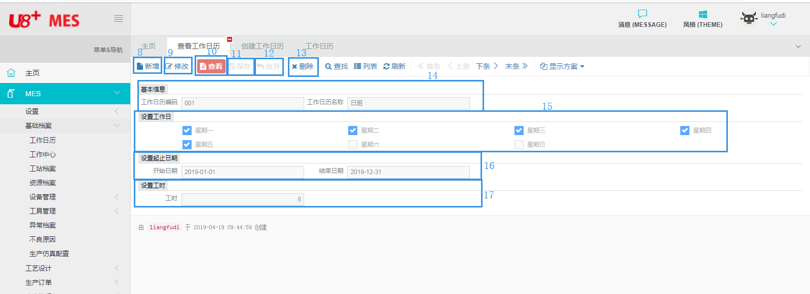

- **操作说明（参照上图）**

1. 点击“MES”,点击“基础档案”，点击“工作日历”，进入工作日历列表页面；

2. 工作日历列表页，显示全部新增的工作日历，可以查询工作日历，对应操作是“4”；

3. 工作日历列表页，点击“新增”，进入新增工作日历页，对应操作是“5”、“8”；

4. 工作日历列表页，点击“工作日历编码”或“工作日历名称”会弹出工作日历详情，对应操作是“6”；

5. 工作日历列表页，点击操作“编辑”，进入查看工作日历页，对应操作是“7”；

6. 查看工作日历页，点击“修改”，修改工作日历，对应操作是“9”；

7. 查看工作日历页，点击“保存”，保存新增或修改的工作日历，对应操作是“11”；

8. 查看工作日历页，点击“放弃”，放弃保存新增或修改的工作日历，对应操作是“12”；

9. 查看工作日历页，点击“删除”删除工作日历，对应操作是“13”；

10. 查看工作日历页，输入基本信息，对应操作是“14”；

11. 查看工作日历页，设置工作日，勾选工作日，对应的操作是“15”；

12. 查看工作日历页，设置起止日期，选择日期，对应操作是“16”；

13. 查看工作日历页，设置工时，输入的工时必须大于等于 0 小于等于 24 的值，对应操作是“17”。

    1. 工作中心

- **菜单路径**

登录 mes3.0—MES—基础档案—工作中心

- **概述**

工作中心是直接改变[物料](http://baike.so.com/doc/5982742-6195707.html)形态或性质的生产作业单元。是用于生产产品的生产资源，包括机器、人和[设备](http://baike.so.com/doc/5342970-5578413.html)，是各种生产或者加工单元的总称。本作业就是对工作中心进行维护。

- **操作界面**

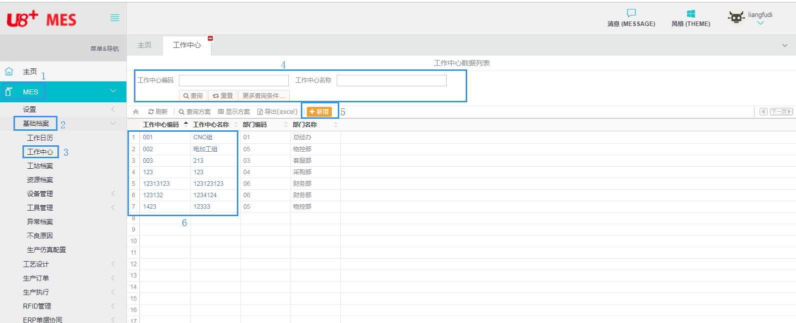

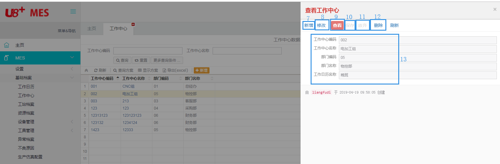

- **操作说明（参照上图）**

1. 点击“MES”,点击“基础档案”，点击“工作中心”，进入工作中心列表页面；

2. 工作中心列表页，列表显示全部的工作中心，可以查询工作中心，对应操作是“4”；

3. 工作中心列表页，点击“新增”弹出工作中心新增页，对应操作是“5”；

4. 工作中心列表页，点击“工作中心编码”或“工作中心名称”，会弹出工作中心的详情页，对应操作是“6”；

5. 工作中心详情页，点击“新增”，弹出工作中心的新增页面，对应操作是“7”；

6. 工作中心详情页，点击“修改”，修改工作中心数据，对应操作是“8”；

7. 工作中心详情页，点击“保存”，保存修改或新增的工作中心，对应操作是“10”；

8. 工作中心详情页，点击“放弃”，放弃保存修改或新增的工作中心，对应操作是“11”；

9. 工作中心详情页，点击“删除”，删除工作中心数据，但已被下级引用的工作中心不能删除，会有相应的提示，对应的操作是“12”；

10. 工作中心详情页，输入或参照档案，组成工作中心的数据，对应的操作是“13”。

    1. 工站档案

- **菜单路径**

登录 mes3.0—MES—基础档案—工站档案

- **概述**

工站是车间数据采集的最小站点、一个工站可以同时支持多台设备的采集，工站隶属于工作中心。是为了便于获取数据和管理人为划分的管理单元。

工站用来采集条码信息，会记录相应的数据：站点、设备、操作时间、操作人员、任务查看、开工、完工、收料、提交异常报告。

本功能主要用来维护工站档案，一个工序可以有多工站，但是一个工站只能有一个工序，也就是说工序与工站的关系是一对多的关系。

- **操作界面**

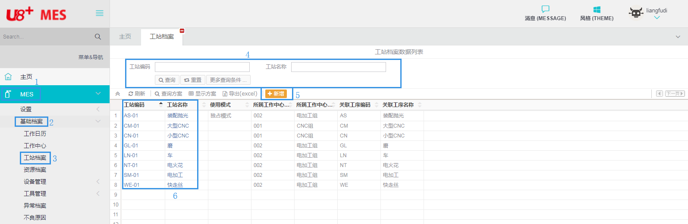

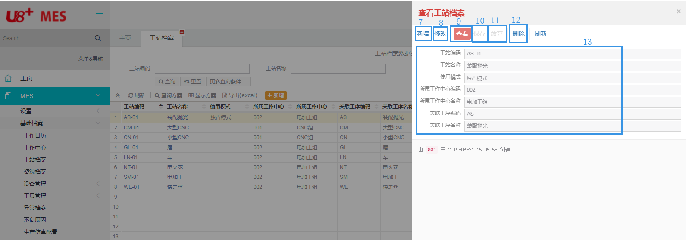

- **操作说明（参照上图）**

1、点击“MES”,点击“基础档案”，点击“工站档案”，进入工站档案列表页面；

2、工站档案列表页，列表显示全部的工站档案，可以查询工站档案，对应操作是“4”；

3、工站档案列表页，点击“新增”弹出工站档案新增页，对应操作是“5”；

4、工站档案列表页，点击“工站档案编码”或“工站档案名称”，会弹出工站档案的详情页，对应操作是“6”；

5、工站档案详情页，点击“新增”，弹出工站档案的新增页面，对应操作是“7”；

6、工站档案详情页，点击“修改”，修改工站档案数据，对应操作是“8”；

7、工站档案详情页，点击“保存”，保存修改或新增的工站档案，对应操作是“10”；

8、工站档案详情页，点击“放弃”，放弃保存修改或新增的工站档案，对应操作是“11”；

9、工站档案详情页，点击“删除”，删除工站档案数据，但已被下级引用的工站档案不能删除，会有相应的提示，对应的操作是“12”；

10、工站档案详情页，输入或参照档案，组成工站档案的数据，对应的操作是“13”。

### 资源档案

- **菜单路径**

登录 mes3.0—MES—基础档案—资源档案

- **概述**

本功能主要用来维护公司可以调配的资源。资源分人工、设备、工具等三种类型。

- **操作界面**

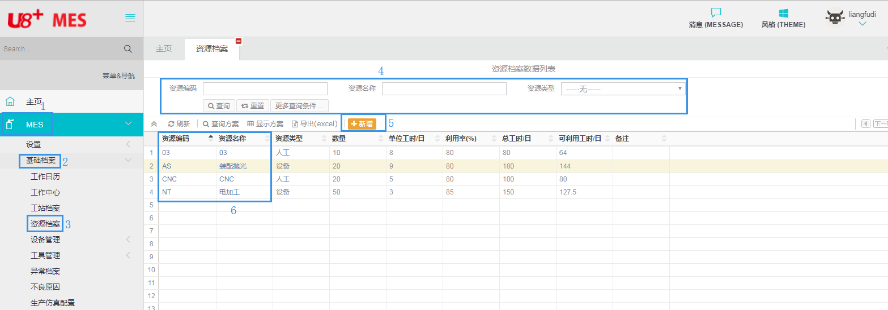

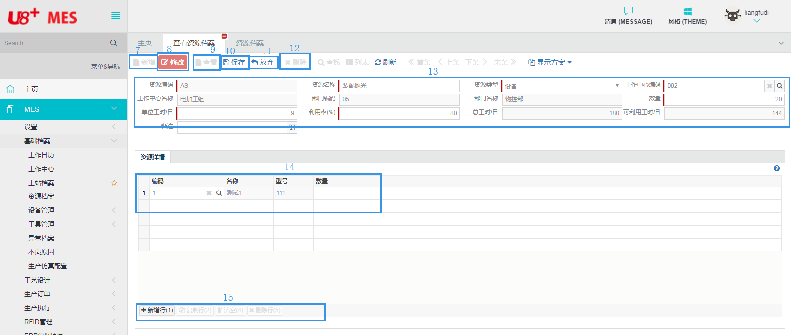

- **操作说明（参照上图）**

1. 点击“MES”,点击“基础档案”，点击“资源档案”，进入资源档案列表页面；

2. 资源档案列表页，列表显示全部的资源档案，可以查询资源档案，对应操作是“4”；

3. 资源档案列表页，点击“新增”进入资源档案新增页，对应操作是“5”；

4. 资源档案列表页，点击“资源编码”或“资源名称”，会进入资源档案的详情页，对应操作是“6”；

5. 资源档案详情页，点击“新增”，进入资源档案的新增页面，对应操作是“7”；

6. 资源档案详情页，点击“修改”，修改资源档案数据，对应操作是“8”；

7. 资源档案详情页，点击“保存”，保存修改或新增的资源档案，对应操作是“10”；

8. 资源档案详情页，点击“放弃”，放弃保存修改或新增的资源档案，对应操作是“11”；

9. 资源档案详情页，点击“删除”，删除资源档案数据，但已被下级引用的资源档案不能删除，会有相应的提示，对应的操作是“12”；

10. 资源档案详情页，输入或参照档案，组成资源档案的表头数据，对应的操作是“13”；

11. 资源档案详情页，输入或参照档案，组成资源档案的表体数据，对应的操作是“14”；

12. 资源档案详情页，表体的行操作有“新增行”、“复制行”、“清空”、“删除行”，对应的操作是“15”。

    1. 设备管理

       1. 设备分类

- **菜单路径**

登录 mes3.0—MES—基础档案—设备管理—设备分类

- **概述**

设备分类用来维护设备的分类信息。

- **操作界面**

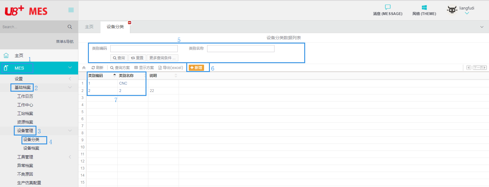

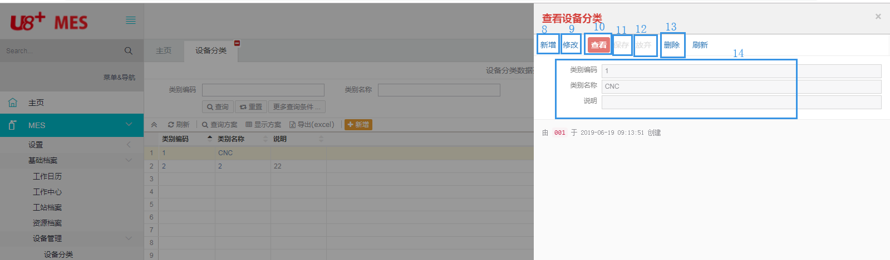

- **操作说明（参照上图）**

1、点击“MES”,点击“基础档案”，点击“设备管理”，点击“设备分类”进入设备分类列表页面；

2、设备分类列表页，列表显示全部的设备分类，可以查询设备分类，对应操作是“5”；

3、设备分类列表页，点击“新增”弹出设备分类新增页，对应操作是“6”；

4、设备分类列表页，点击“设备分类编码”或“设备分类名称”，会弹出设备分类的详情页，对应操作是“7”；

5、设备分类详情页，点击“新增”，弹出设备分类的新增页面，对应操作是“8”；

6、设备分类详情页，点击“修改”，修改设备分类数据，对应操作是“9”；

7、设备分类详情页，点击“保存”，保存修改或新增的设备分类，对应操作是“11”；

8、设备分类详情页，点击“放弃”，放弃保存修改或新增的设备分类，对应操作是“12”；

9、设备分类详情页，点击“删除”，删除设备分类数据，但已被下级引用的设备分类不能删除，会有相应的提示，对应的操作是“13”；

10、设备分类详情页，输入或参照档案，组成设备分类的数据，对应的操作是“14”。

1. 设备档案

- **菜单路径**

登录 mes3.0—MES—基础档案—设备管理—设备档案

- **概述**

维护设备档案

- **操作界面**

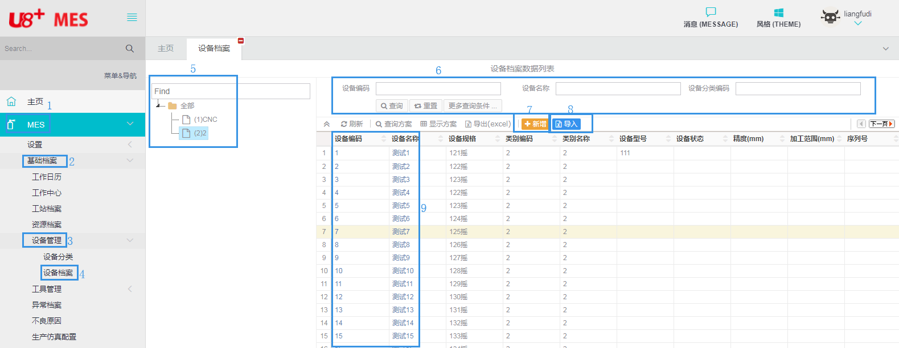

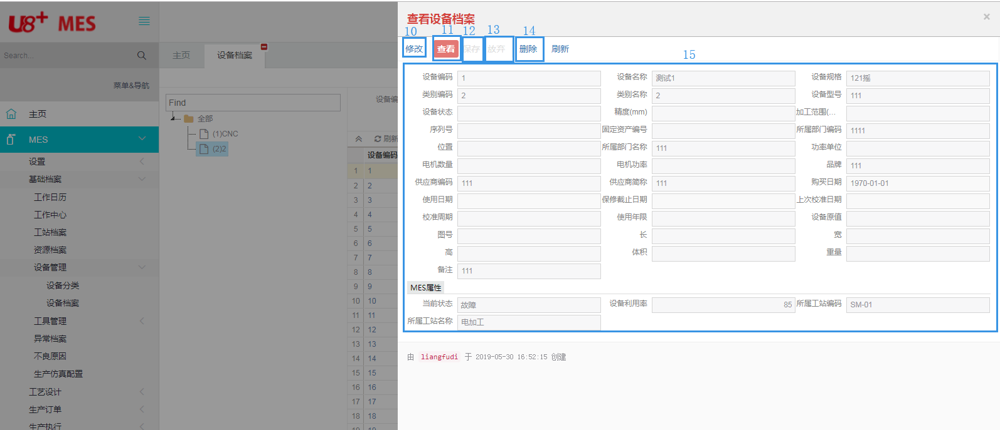

- **操作说明（参照上图）**

1. 点击“MES”，点击“基础档案”，点击“设备管理”，点击“设备档案”，进入设备档案列表页面；

2. 设备档案列表页，左侧显示设备分类，选中设备分类，在设备分类下新增设备档案，对应操作是“5”；

3. 设备档案列表页，列表显示全部的设备档案，可以查询设备档案，对应操作是“6”；

4. 设备档案列表页，点击“新增”弹出设备档案新增页，对应操作是“7”；

5. 设备档案列表页，点击“导入”，，进入导入设备档案页面，根据导入模板进行导入设备档案数据，对应操作是“8”；

6. 设备档案列表页，点击“设备编码”或“设备名称”，会弹出设备档案的详情页，对应操作是“9”；

7. 设备档案详情页，点击“修改”，修改设备档案数据，对应操作是“10”；

8. 设备档案详情页，点击“保存”，保存修改或新增的设备档案，对应操作是“12”；

9. 设备档案详情页，点击“放弃”，放弃保存修改或新增的设备档案，对应操作是“13”；

10. 设备档案详情页，点击“删除”，删除设备档案数据，但已被下级引用的设备档案不能删除，会有相应的提示，对应的操作是“14”；

11. 设备档案详情页，输入或参照档案，组成设备档案的数据，对应的操作是“15”。

    1. 工具管理

       1. 工具分类

- **菜单路径**

登录 mes3.0—MES—基础档案—工具管理—工具档案

- **概述**

维护工具的分类信息。

- **操作界面**

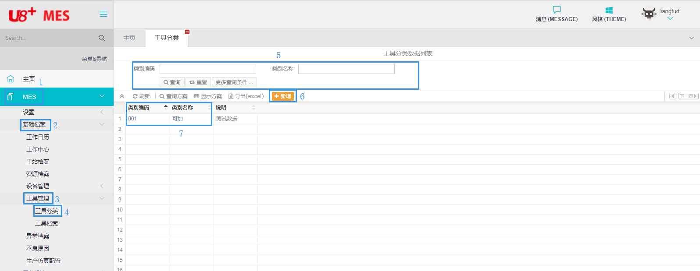

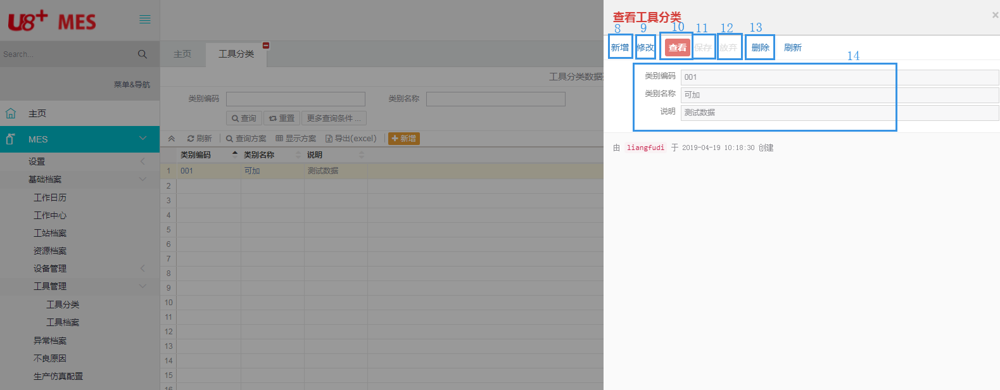

- **操作说明（参照上图）**

1、点击“MES”,点击“基础档案”，点击“设备管理”，点击“工具分类”进入工具分类列表页面；

2、工具分类列表页，列表显示全部的工具分类，可以查询工具分类，对应操作是“5”；

3、工具分类列表页，点击“新增”弹出工具分类新增页，对应操作是“6”；

4、工具分类列表页，点击“工具分类编码”或“工具分类名称”，会弹出工具分类的详情页，对应操作是“7”；

5、工具分类详情页，点击“新增”，弹出工具分类的新增页面，对应操作是“8”；

6、工具分类详情页，点击“修改”，修改工具分类数据，对应操作是“9”；

7、工具分类详情页，点击“保存”，保存修改或新增的工具分类，对应操作是“11”；

8、工具分类详情页，点击“放弃”，放弃保存修改或新增的工具分类，对应操作是“12”；

9、工具分类详情页，点击“删除”，删除工具分类数据，但已被下级引用的工具分类不能删除，会有相应的提示，对应的操作是“13”；

10、工具分类详情页，输入或参照档案，组成工具分类的数据，对应的操作是“14”。

1. 工具档案

- **菜单路径**

登录 mes3.0—MES—基础档案—工具管理—工具档案

- **概述**

维护工具档案。

- **操作界面**

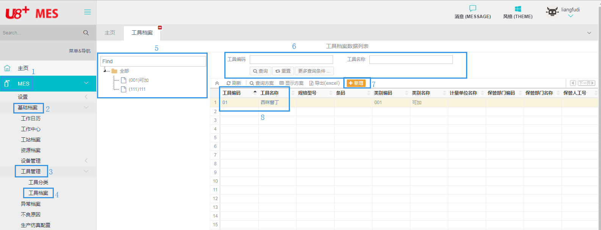

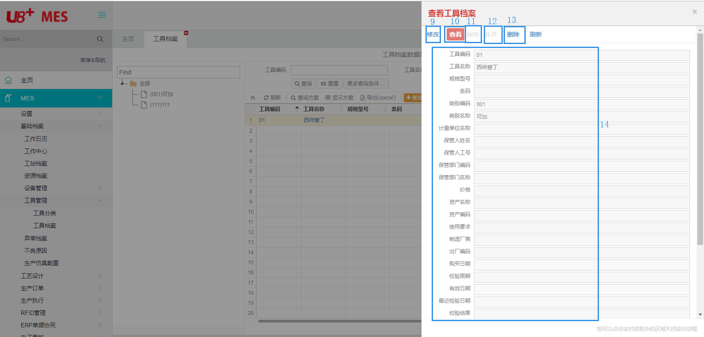

- **操作说明（参照上图）**

1. 点击“MES”，点击“基础档案”，点击“工具管理”，点击“工具档案”，进入工具档案列表页面；

2. 工具档案列表页，左侧显示工具分类，选中工具分类，在工具分类下新增工具档案，对应操作是“5”；

3. 工具档案列表页，列表显示全部的工具档案，可以查询工具档案，对应操作是“6”；

4. 工具档案列表页，点击“新增”弹出工具档案新增页，对应操作是“7”；

5. 工具档案列表页，点击“工具编码”或“工具名称”，会弹出工具档案的详情页，对应操作是“9”；

6. 工具档案详情页，点击“修改”，修改工具档案数据，对应操作是“9”；

7. 工具档案详情页，点击“保存”，保存修改或新增的工具档案，对应操作是“10”；

8. 工具档案详情页，点击“放弃”，放弃保存修改或新增的工具档案，对应操作是“12”；

9. 工具档案详情页，点击“删除”，删除工具档案数据，但已被下级引用的工具档案不能删除，会有相应的提示，对应的操作是“13”；

10. 工具档案详情页，输入或参照档案，组成工具档案的数据，对应的操作是“14”。

    1. 异常档案

- **菜单路径**

登录 mes3.0—MES—基础档案—异常档案

- **概述**

异常档案主要用来收集，整理造成工站停工的异常信息，便于工站快速提报问题；同时，也可以对这些异常产生的原因分析，形成解决方案或预案，快速响应，及时解决问题。

- **操作界面**

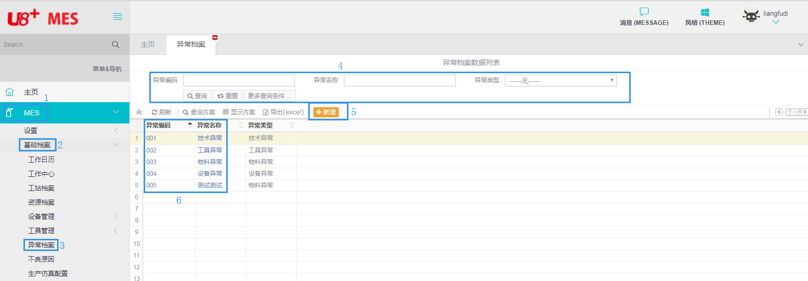

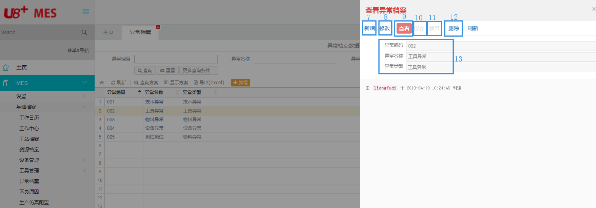

- **操作说明（参照上图）**

1、点击“MES”,点击“基础档案”，点击“异常档案”，进入异常档案列表页面；

2、异常档案列表页，列表显示全部的异常档案，可以查询异常档案，对应操作是“4”；

3、异常档案列表页，点击“新增”弹出异常档案新增页，对应操作是“5”；

4、异常档案列表页，点击“异常档案编码”或“异常档案名称”，会弹出异常档案的详情页，对应操作是“6”；

5、异常档案详情页，点击“新增”，弹出异常档案的新增页面，对应操作是“7”；

6、异常档案详情页，点击“修改”，修改异常档案数据，对应操作是“8”；

7、异常档案详情页，点击“保存”，保存修改或新增的异常档案，对应操作是“10”；

8、异常档案详情页，点击“放弃”，放弃保存修改或新增的异常档案，对应操作是“11”；

9、异常档案详情页，点击“删除”，删除异常档案数据，但已被下级引用的异常档案不能删除，会有相应的提示，对应的操作是“12”；

10、异常档案详情页，输入或参照档案，组成异常档案的数据，对应的操作是“13”。

### 不良原因

- **菜单路径**

登录 mes3.0—MES—基础档案—不良原因

- **概述**

维护不良原因分类和不良原因档案。

- **操作界面**

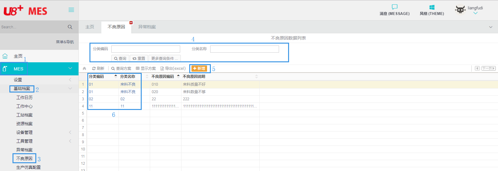

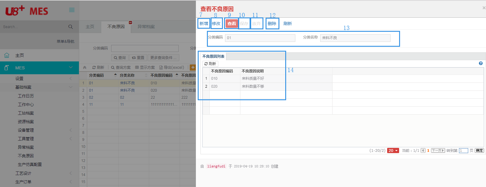

- **操作说明（参照上图）**

1、点击“MES”,点击“基础档案”，点击“不良分类”，进入不良分类列表页面；

2、不良分类列表页，列表显示全部的不良分类，可以查询不良分类，对应操作是“4”；

3、不良分类列表页，点击“新增”弹出不良分类新增页，对应操作是“5”；

4、不良分类列表页，点击“不良分类编码”或“不良分类名称”，会弹出不良分类的详情页，对应操作是“6”；

5、不良分类详情页，点击“新增”，弹出不良分类的新增页面，对应操作是“7”；

6、不良分类详情页，点击“修改”，修改不良分类数据，对应操作是“8”；

7、不良分类详情页，点击“保存”，保存修改或新增的不良分类，对应操作是“10”；

8、不良分类详情页，点击“放弃”，放弃保存修改或新增的不良分类，对应操作是“11”；

9、不良分类详情页，点击“删除”，删除不良分类数据，但已被下级引用的不良分类不能删除，会有相应的提示，对应的操作是“12”；

10、不良分类详情页，输入或参照档案，组成不良分类的数据，对应的操作是“13”。

### 生产仿真配置

- **菜单路径**

登录 mes3.0—MES—基础档案—生产仿真配置

- **概述**

上传工厂的平面图（PNG 格式图像），以便设备可以布置在这个图像上。

- **操作界面**

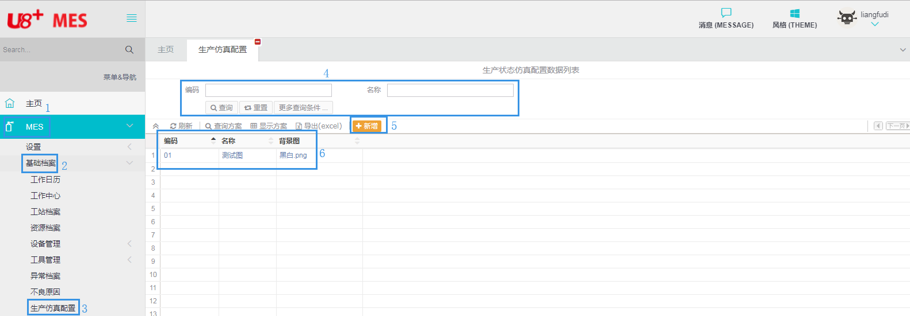

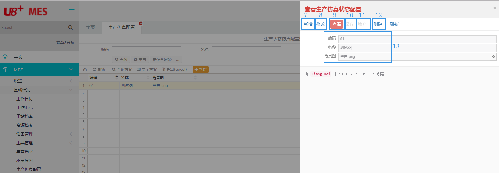

- **操作说明（参照上图）**

1、点击“MES”,点击“基础档案”，点击“生产仿真配置”，进入生产仿真配置列表页面；

2、生产仿真配置列表页，列表显示全部的生产仿真配置，可以查询生产仿真配置，对应操作是“4”；

3、生产仿真配置列表页，点击“新增”弹出生产仿真配置新增页，对应操作是“5”；

4、生产仿真配置列表页，点击“编码”或“名称”，会弹出生产仿真配置的详情页，对应操作是“6”；

5、生产仿真配置详情页，点击“新增”，弹出生产仿真配置的新增页面，对应操作是“7”；

6、生产仿真配置详情页，点击“修改”，修改生产仿真配置数据，对应操作是“8”；

7、生产仿真配置详情页，点击“保存”，保存修改或新增的生产仿真配置，对应操作是“10”；

8、生产仿真配置详情页，点击“放弃”，放弃保存修改或新增的生产仿真配置，对应操作是“11”；

9、生产仿真配置详情页，点击“删除”，删除生产仿真配置数据，但已被下级引用的生产仿真配置不能删除，会有相应的提示，对应的操作是“12”；

10、生产仿真配置详情页，输入或参照档案，组成生产仿真配置的数据，对应的操作是“13”。

1. 工艺设计

   1. 工段档案

- **菜单路径**

登录 mes3.0—MES—工艺设计—工段档案

- **概述**

维护工段档案

- **操作界面**

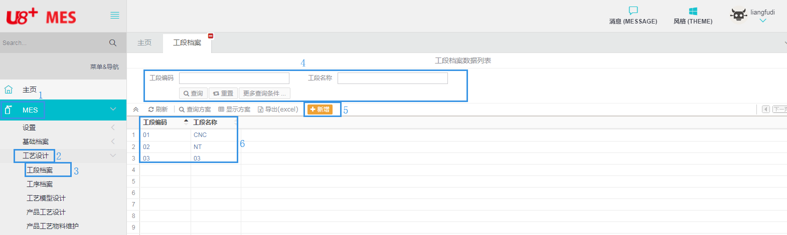

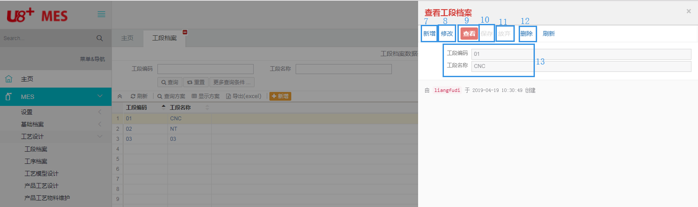

- **操作说明（参照上图）**

1、点击“MES”,点击“工艺设计”，点击“工段档案”，进入工段档案列表页面；

2、工段档案列表页，列表显示全部的工段档案，可以查询工段档案，对应操作是“4”；

3、工段档案列表页，点击“新增”弹出工段档案新增页，对应操作是“5”；

4、工段档案列表页，点击“工段编码”或“工段名称”，会弹出工段档案的详情页，对应操作是“6”；

5、工段档案详情页，点击“新增”，弹出工段档案的新增页面，对应操作是“7”；

6、工段档案详情页，点击“修改”，修改工段档案数据，对应操作是“8”；

7、工段档案详情页，点击“保存”，保存修改或新增的工段档案，对应操作是“10”；

8、工段档案详情页，点击“放弃”，放弃保存修改或新增的工段档案，对应操作是“11”；

9、工段档案详情页，点击“删除”，删除工段档案数据，但已被下级引用的工段档案不能删除，会有相应的提示，对应的操作是“12”；

10、工段档案详情页，输入或参照档案，组成工段档案的数据，对应的操作是“13”。

### 工序档案

- **菜单路径**

登录 mes3.0—MES—工艺设计—工序档案

- **概述**

维护工序档案

- **操作界面**

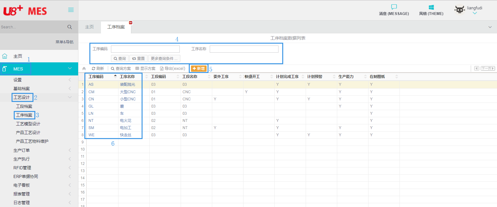

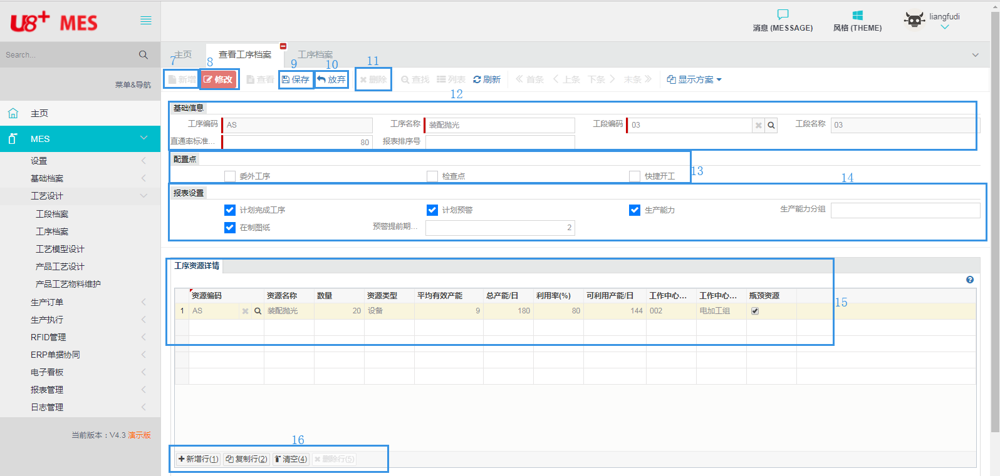

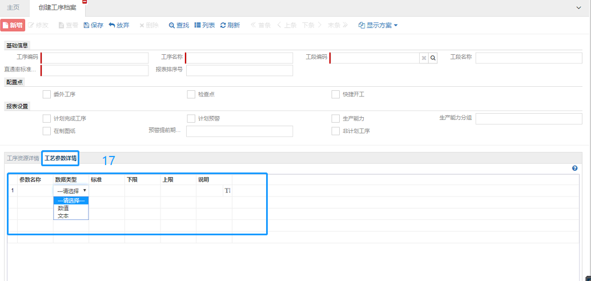

- **操作说明（参照上图）**

1. 点击“MES”,点击“工艺设计”，点击“工序档案”，进入工序档案列表页面；

2. 工序档案列表页，列表显示全部的工序档案，可以查询工序档案，对应操作是“4”；

3. 工序档案列表页，点击“新增”进入工序档案新增页，对应操作是“5”；

4. 工序档案列表页，点击“工序编码”或“工序名称”，会进入工序档案的详情页，对应操作是“6”；

5. 工序档案详情页，点击“新增”，转到新增工序页面，对应操作是“7”；

6. 工序档案详情页，点击“修改”，转到工序修改页面，对应操作是“8”；

7. 工序档案详情页，点击“保存”，保存修改或新增的工序数据，对应操作是“9”；

8. 工序档案详情页，点击“放弃”，放弃保存修改或新增的工序数据，对应操作是“10”；

9. 工序档案详情页，点击“删除”，删除工序档案数据，但已被下级引用的工序档案不能删除，会有相应的提示，对应的操作是“11”；

10. 工序档案详情页，基础信息，输入或参照档案，组成工序档案的数据，对应的操作是“12”。

11. 工序档案详情页，配置点，配置工序的属性，委外工序、检查点、快捷开工，对应操作是“13”；

12. 工序档案详情页，报表设置，设置工序在报表中是否显示和工序是否做计划预警，对应操作是“14”；

13. 工序档案详情页，表体是工序资源详情，选择工序的资源详情，对应操作是“15”；

14. 工序档案详情页，表体工序资源详情列表的操作有新增行、复制行、清空、删除行，对应操作是“16”。

15. 工序档案详情页，表体的工艺参数详情可以新增，选择数值和文本类型，记录流程卡报工的数值。

    1. 工艺模型设计

- **菜单路径**

登录 mes3.0—MES—工艺设计—工艺模型设计

- **概述**

将标准生产工艺进行建模，方便产品设计工艺时引用，提高工艺录入效率。

- **操作界面**

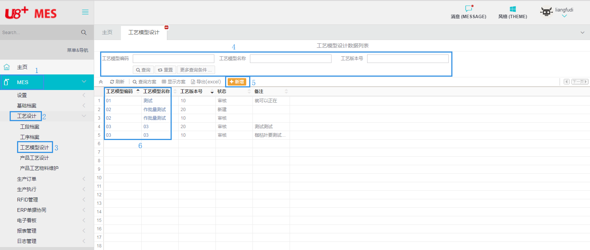

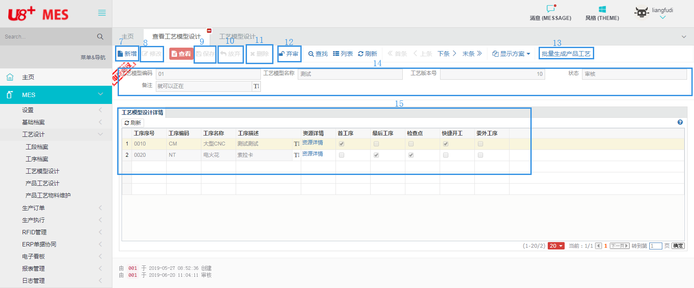

- **操作说明（参照上图）**

1. 点击“MES”,点击“工艺设计”，点击“工艺模型设计”，进入工艺模型设计列表页面；

2. 工艺模型设计列表页，列表显示全部的工艺模型设计，可以查询工艺模型设计，对应操作是“4”；

3. 工艺模型设计列表页，点击“新增”进入工艺模型设计新增页，对应操作是“5”；

4. 工艺模型设计列表页，点击“工艺模型编码”或“工艺模型名称”，会进入工艺模型设计的详情页，对应操作是“6”；

5. 工艺模型设计详情页，点击“新增”，进入工艺模型设计的新增页面，对应操作是“7”；

6. 工艺模型设计详情页，点击“修改”进入工艺模型设计的修改页面，对应操作是“8”；

7. 工艺模型设计详情页，点击“保存”，保存新增或修改的工艺模型设计，对应操作是“9”；

8. 工艺模型设计详情页，点击“放弃”，放弃保存新增或修改的工艺模型设计，对应操作是“10”；

9. 工艺模型设计详情页，点击“删除”，删除工艺模型设计数据，但已被下级引用的工艺模型设计不能删除，会有相应的提示，对应的操作是“11”；

10. 工艺模型设计详情页，点击“审核/弃审”，审核/弃审工艺模型设计，对应操作是“12”，审核后的工艺模型才能被产品工艺设计引用的；

11. 工艺模型设计详情页，审核后才有“批量生成产品工艺”功能，点击“批量生成产品工艺”，批量生成已审核的产品工艺设计，对应操作是“13”；

12. 工艺模型设计详情页，输入或参照档案，组成工艺模型设计的数据，对应的操作是“14”；

13. 工艺模型设计详情页，工艺模型设计详情，参照工序档案输入，对应操作“15”；

    1. 产品工艺设计

- **菜单路径**

登录 mes3.0—MES—工艺设计—产品工艺设计

- **概述**

对具体的产品进行产品工艺设计和维护。

- **操作界面**

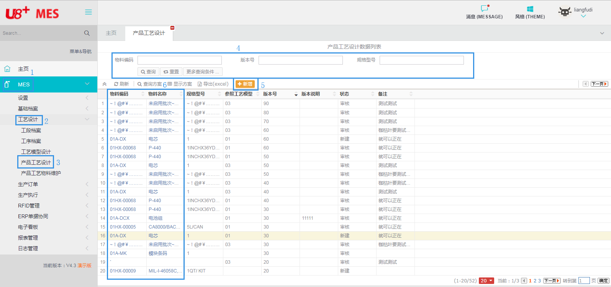

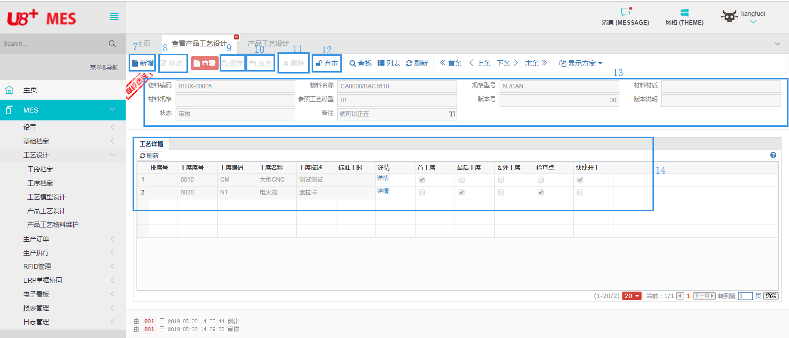

- **操作说明（参照上图）**

1. 点击“MES”,点击“工艺设计”，点击“产品工艺设计”，进入产品工艺设计列表页面；

2. 产品工艺设计列表页，列表显示全部的产品工艺设计，可以查询产品工艺设计，对应操作是“4”；

3. 产品工艺设计列表页，点击“新增”进入产品工艺设计新增页，对应操作是“5”；

4. 产品工艺设计列表页，点击“物料编码”或“物料名称”，进入产品工艺设计的详情页，对应操作是“6”；

5. 产品工艺设计详情页，点击“新增”，进入产品工艺设计的新增页面，对应操作是“7”；

6. 产品工艺设计详情页，点击“修改”，修改产品工艺设计数据，对应操作是“8”；

7. 产品工艺设计详情页，点击“保存”，保存修改或新增的产品工艺设计，对应操作是“9”；

8. 产品工艺设计详情页，点击“放弃”，放弃保存修改或新增的产品工艺设计，对应操作是“10”；

9. 产品工艺设计详情页，点击“删除”，删除产品工艺设计数据，但已被下级引用的产品工艺设计不能删除，会有相应的提示，对应的操作是“11”；

10. 产品工艺设计详情页，点击“审核/弃审”，审核/弃审产品工艺设计，审核后的产品工艺才能被下级引用，对应操作是“12”；

11. 产品工艺设计详情页，输入或参照档案，组成产品工艺设计的数据，对应的操作是“13”；

12. 产品工艺设计详情页，工艺详情，显示工序，对应操作是“14”。

    1. 产品工艺物料维护

- **菜单路径**

登录 mes3.0—MES—工艺设计—产品工艺物料维护

- **概述**

设置原材料在产品工艺的哪道工序投放物料和投放数量，用于原材料的投料防错。

- **操作界面**

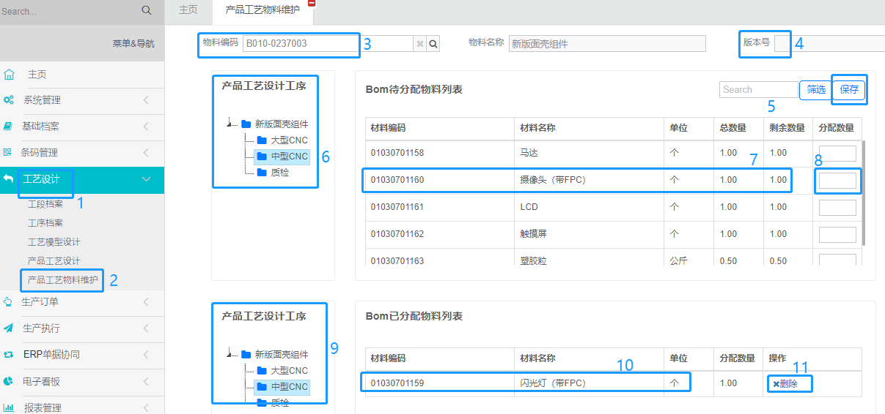

- **操作说明（参照上图）**

1、本功能主要是设置一个产品工艺工序与其 BOM 物料投放关系；

2、单击“工艺设计”，对应操作“1”；

3、单击“产品工艺物料维护”，对应操作“2”；

4、选择“物料编码”，对应操作“3”；

5、该物料产品工艺的“版本号”，对应显示“4”；

6、将 BOM 中的物料分配到产品工艺的工序中，包含何种物料投放到哪道工序，投料数量多少，对应操作“6”、“7”、“8”；

7、对已分配不对的，可以删除，对应操作“9”、“10”、“11”

8、点击“保存”，保存结果，对应操作“5”；

9、点击“放弃”，不保存结果退出界面。

## 1.4 生产订单

### 1.4.1 生产订单

- **菜单路径**

登录 mes3.0—MES—生产订单—生产订单

- **概述**

查看 ERP 的生产订单和生产订单子件，不能修改和删除。是为了方便用户，查询生产订单在 MES 就可以查询，不用切换到 ERP 中去查询。

- **操作界面**

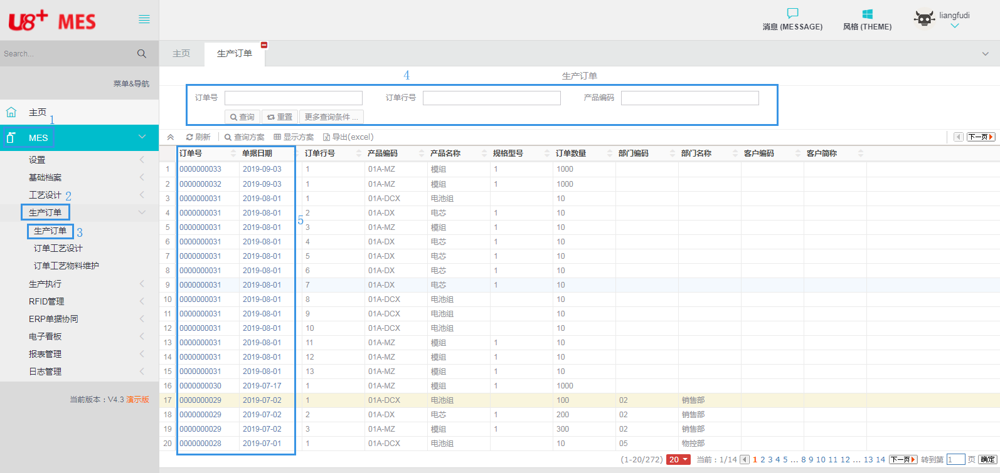

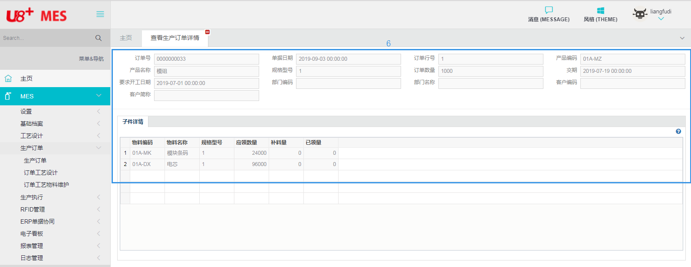

- **操作说明（参照上图）**

1. 点击“MES”,点击“生产订单”，点击“生产订单”，进入生产订单列表页面；

2. 生产订单列表页，列表显示全部的生产订单，可以查询生产订单，对应操作是“4”；

3. 生产订单列表页，点击“订单号”或“单据日期”，进入生产订单的详情页，对应操作是“5”；

4. 生产订单详情页，显示生产订单详情信息，对应操作是“6”不能修改、新增、删除生产订单。

### 1.4.2 订单工艺设计

- **菜单路径**

登录 mes3.0—MES—生产订单—订单工艺设计

- **概述**

对某生产订单某行具体的产品进行产品工艺设计和维护，类似于产品定制。

- **操作界面**

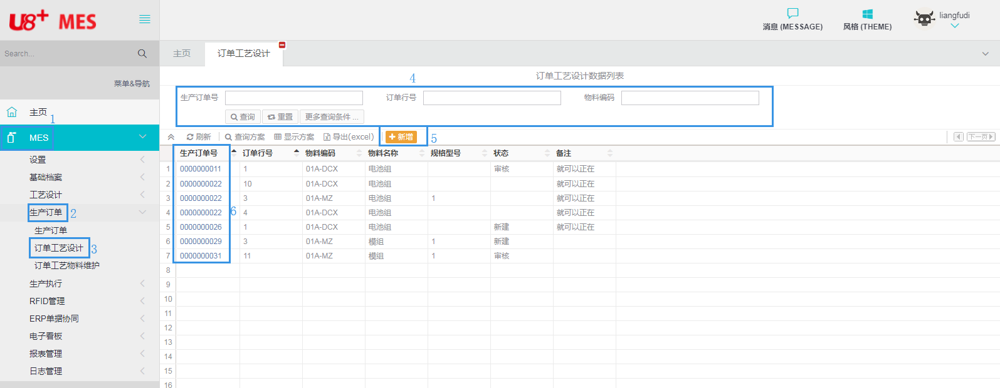

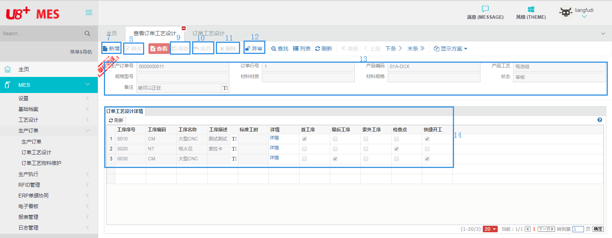

- **操作说明（参照上图）**

1. 点击“MES”,点击“生产订单”，点击“订单工艺设计”，进入订单工艺设计列表页面；

2. 订单工艺设计列表页，列表显示全部的订单工艺设计，可以查询订单工艺设计，对应操作是“4”；

3. 订单工艺设计列表页，点击“新增”进入订单工艺设计新增页，对应操作是“5”；

4. 订单工艺设计列表页，点击“订生产订单号”，进入订单工艺设计的详情页，对应操作是“6”；

5. 订单工艺设计详情页，点击“新增”，进入订单工艺设计的新增页面，对应操作是“7”；

6. 订单工艺设计详情页，点击“修改”，修改订单工艺设计数据，对应操作是“8”；

7. 订单工艺设计详情页，点击“保存”，保存修改或新增的订单工艺设计，对应操作是“9”；

8. 订单工艺设计详情页，点击“放弃”，放弃保存修改或新增的订单工艺设计，对应操作是“10”；

9. 订单工艺设计详情页，点击“删除”，删除订单工艺设计数据，对应的操作是“11”；

10. 订单工艺设计详情页，点击“审核/弃审”，审核\\弃审订单工艺设计，对应操作是“12”，审核的订单工艺设计才能被下级引用；

11. 订单工艺设计详情页，输入或参照档案，组成订单工艺设计的数据，对应的操作是“13”；

12. 订单工艺设计详情页，订单工艺设计详情，参照工序档案，选择工序，对应操作是“14”；

### 1.4.3 订单工艺物料维护

- **菜单路径**

登录 mes3.0—MES—生产订单—订单工艺物料维护

- **概述**

设置某生产订单某行的原材料在订单工艺的哪道工序投放物料和投放数量，用于原材料的投料防错。

- **操作界面**

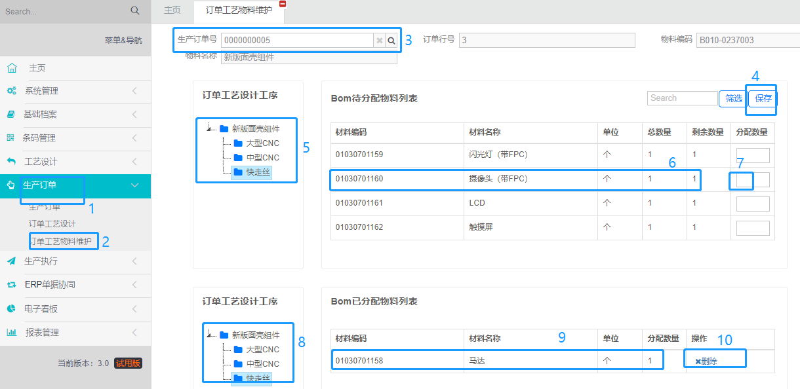

- **操作说明（参照上图）**

1、本功能主要是设置一个订单工艺工序与其 BOM 物料投放关系；

2、单击“生产订单”，对应操作“1”；

3、单击“订单工艺物料维护”，对应操作“2”；

4、选择一个生产订单的一行，对应操作“3”；

5、修改内容，对应操作“5”、“6”、“7”、“8”、“9”、“10”；

6、单击“保存”，保存物料分配设置，对应操作“4”。

## 1.5 生产计划

### 1.5.1 生产主计划

- **菜单路径**

登录 mes3.0—MES—生产计划—生产主计划

- **概述**

根据生产订单排生产计划，每天排做多少数量。

- **操作界面**

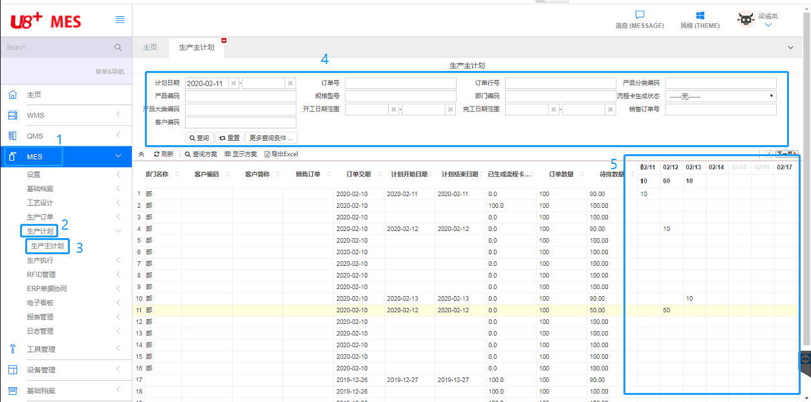

- **操作说明（参照上图）**

1. 点击“MES”,点击“生产计划”，点击“生产主计划”，进行生产主计划列表页面；

2. 生产主计划列表页，可以查询生产订单的计划情况，对应操作是“4”；

3. 生产主计划列表页，可以排数量到哪天，对应操作是“5”；

## 1.6 生产执行

### 1.6.1 流程卡生成

- **菜单路径**

登录 mes3.0—MES—生产执行—流程卡生成

- **概述**

将已经审核，但是没有生成流程卡的生产订单批量生成流程卡。

- **操作界面**

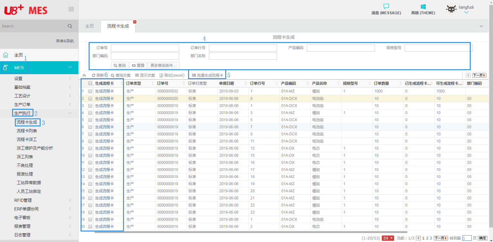

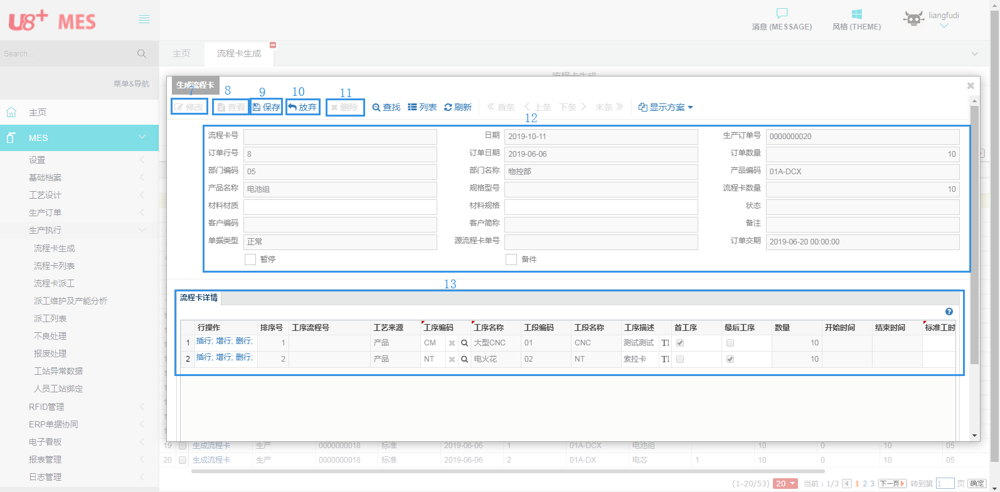

- **操作说明（参照上图）**

1. 点击“MES”,点击“生产执行”，点击“流程卡生成”，进入流程卡生成列表页面；

2. 流程卡生成列表页，列表显示全部未生成流程卡的生产订单，可以查询流程卡生成，对应操作是“4”；

3. 流程卡生成列表页，点击“批量生成流程卡”弹出流程卡生成页面，对应操作是“5”；

4. 流程卡生成列表页，点击“生成流程卡”，会弹出生成流程卡页，对应操作是“6”；

5. 流程卡生成页，点击“修改”，修改流程卡生成数据，对应操作是“7”；

6. 流程卡生成页，点击“保存”，保存修改或新增的流程卡生成，对应操作是“9”；

7. 流程卡生成页，点击“放弃”，放弃保存修改或新增的流程卡生成，对应操作是“10”；

8. 流程卡生成页，点击“删除”，删除流程卡生成数据，但已被下级引用的流程卡不能删除，会有相应的提示，对应的操作是“11”；

9. 流程卡生成页，表头显示流程卡的详细信息，对应操作为“12”；

10. 流程卡生成页，表体流程卡详情，表体列表可以插行、增行、删行得对工序进行操作，对应操作为“13”。

### 1.6.2 流程卡列表

- **菜单路径**

登录 mes3.0—MES—生产执行—流程卡列表

- **概述**

对已经生成的流程卡查询、修改、删除和导出操作。

- **操作界面**

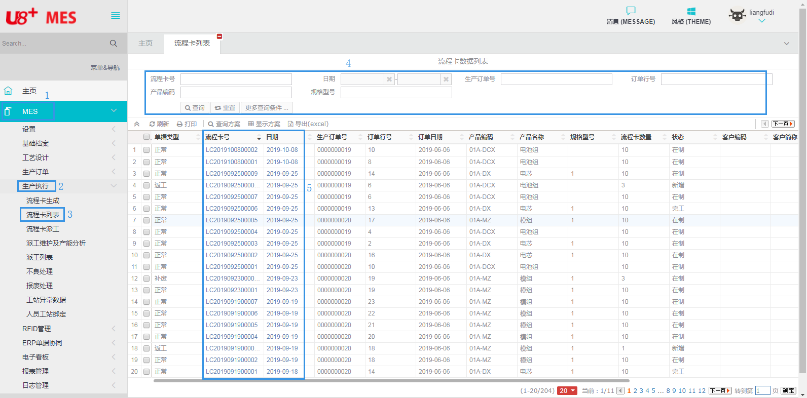

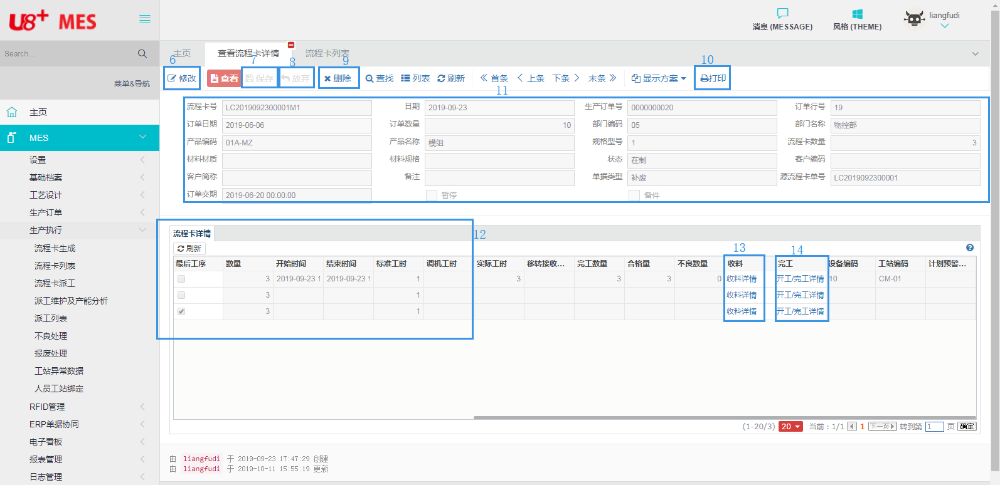

- **操作说明（参照上图）**

1. 点击“MES”,点击“生产执行”，点击“流程卡列表”，进入流程卡列表页面；

2. 流程卡列表页，列表显示全部的流程卡，可以查询流程卡，对应操作是“4”；

3. 流程卡列表页，点击“流程卡号”或“日期”，进入流程卡的详情页，对应操作是“5”；

4. 流程卡详情页，点击“修改”，修改流程卡数据，对应操作是“6”；

5. 流程卡详情页，点击“保存”，保存修改的流程卡，对应操作是“7”；

6. 流程卡详情页，点击“放弃”，放弃保存修改的流程卡，对应操作是“8”；

7. 流程卡详情页，点击“删除”，删除流程卡数据，但已被下级引用的流程卡不能删除，会有相应的提示，对应的操作是“9”；

8. 流程卡详情页，点击“打印”，打印流程卡数据，对应操作是“10”

9. 流程卡详情页，表头显示流程卡数据，对应的操作是“11”；

10. 流程卡详情页，表体显示流程卡详情，可以插行、增行、删行，对应操作是“12”，但有收过料的不允许插行和删行；

11. 流程卡详情页，表体中点击“收料详情”，弹出查看收料详情，对应操作是“13”；

12. 流程卡详情页，表体中点击“开工/完工详情”弹出查看开工/完工详情，对应操作是“14”，开工/完工详情中可以修改完工数量，只能改小于完工数量。

### 1.6.3 流程卡派工

- **菜单路径**

登录 mes3.0—MES—生产执行—流程卡派工

- **概述**

对流程卡派工，即安排生产。将根据流程卡上的信息，将各个工序分配到工序对应的工站，在工站的任务列表中可以查看到。

- **操作界面**

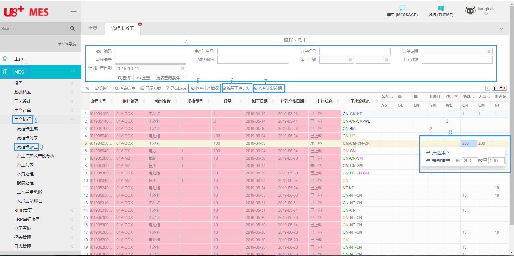

- **操作说明（参照上图）**

1. 点击“MES”,点击“生产执行”，点击“流程卡派工”，进入流程卡派工列表页面；

2. 流程卡派工列表页，列表显示全部未完式的流程卡，可以查询流程卡派工，对应操作是“4”；

3. 流程卡派工列表页，点击“检查排产情况”，列表显示当天派工的工序用蓝色显示，对应操作是“5”；

4. 流程卡派工列表页，点击“推算工序计划”，计算预警工序的日期，在流程卡详情中显示，对应操作是“6”；

5. 流程卡派工列表页，点击“检查计划逾期”，超过计划日期还没有完工的工序用红色显示出来，对应操作是“7”；

6. 流程卡派工列表页，工序下的工时右键点击可以推送排产，对应操作是“8”。

### 1.6.4 派工维护及产能分析

- **菜单路径**

登录 mes3.0—MES—生产执行—派工维护及产能分析

- **概述**

对已经派工的流程卡进行维护，查看各工站产能负荷比。

- **操作界面**

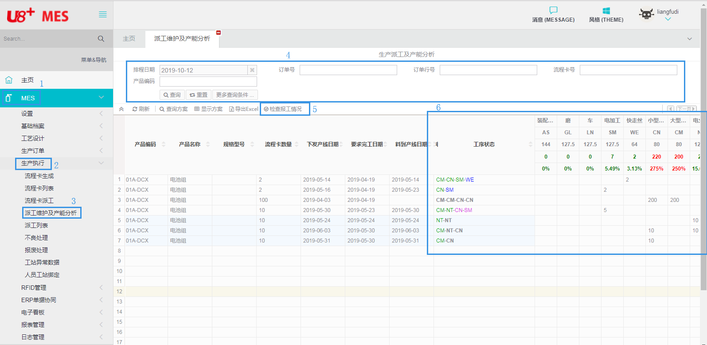

- **操作说明（参照上图）**

1. 点击“MES”,点击“生产执行”，点击“派工维护及产能分析”，进入派工维护及产能分析列表页面；

2. 派工维护及产能分析列表页，列表显示全部的派工维护及产能分析，可以查询派工维护及产能分析，对应操作是“4”；

3. 派工维护及产能分析列表页，点击“检查报工情况”，列表工序工时会显示有过报工但还没完成的工序显示绿色，对应操作是“5”；

4. 派工维护及产能分析列表页，列表显示当天派工的工序工时，对应操作是“6”；

### 1.6.5 派工列表

- **菜单路径**

登录 mes3.0—MES—生产执行—派工列表

- **概述**

对派工结果进行查看、导出、批量删除和修改派工工时。

- **操作界面**

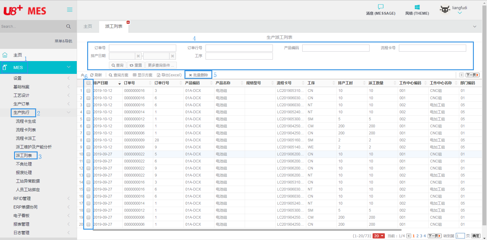

- **操作说明（参照上图）**

1. 点击“MES”,点击“生产执行”，点击“派工列表”，进入派工列表列表页面；

2. 派工列表页，列表显示全部的派工列表，可以查询派工列表，对应操作是“4”；

3. 派工列表页，点击“批量删除”勾选数据可以批量删除，数据回填，对应操作是“5”，勾选是“6”。

### 1.6.6 不良处理

- **菜单路径**

登录 mes3.0—MES—生产执行—不良处理

- **概述**

将工站不良品报工明细列出来，做出对应的处理。

- **操作界面**

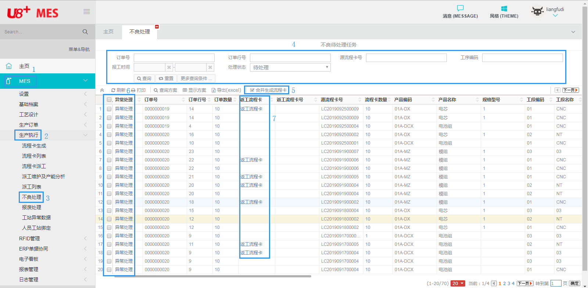

- **操作说明（参照上图）**

1. 点击“MES”,点击“生产执行”，点击“不良处理”，进入不良处理列表页面；

2. 不良处理列表页，列表显示全部的不良处理，可以查询不良处理，对应操作是“4”；

3. 不良处理列表页，选中来自相同流程卡要生成返工流程卡的任务，点击“合并生成流程卡”，生成返工流程卡，对应操作是“5”；

4. 不良处理列表页，点击“异常处理”，弹出不良处理任务页，不良数作返工、报废补单、让步接收、报废补流程卡、报废的处理，对应操作是“6”；

5. 不良处理列表页，点击“返工流程卡”，生成返工流程卡，对应操作是“7”。

### 1.6.7 报废处理

- **菜单路径**

登录 mes3.0—MES—生产执行—报废处理

- **概述**

查询出不良处理为“报废补单”的报工单，做出对应的处理。

- **操作界面**

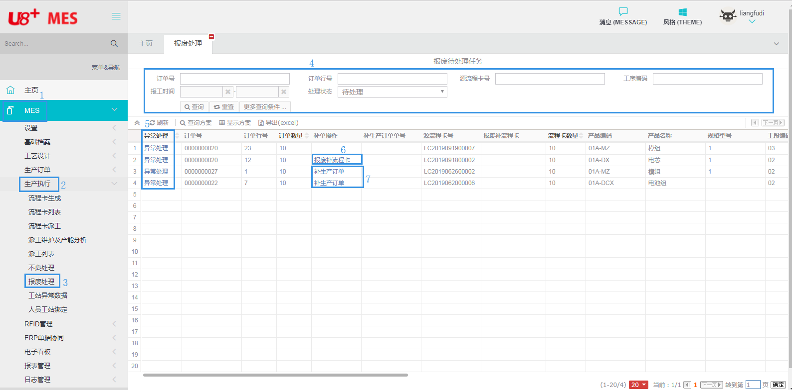

- **操作说明（参照上图）**

1. 点击“MES”,点击“生产执行”，点击“报废处理”，进入报废处理列表页面；

2. 报废处理列表页，列表显示全部的报废处理，可以查询报废处理，对应操作是“4”；

3. 报废处理列表页，点击“异常处理”，弹出不良处理任务页，不良数作返工、报废补单、让步接收、报废补流程卡、报废的处理，对应操作是“5”；

4. 报废处理列表页，点击“报废补流程卡”，生成补废流程卡，对应操作是“6”；

5. 报废处理列表页，点击“补生产订单”标记要去 U8 补生产订单标记，对应操作“7”。

### 1.6.8 工站异常数据

- **菜单路径**

登录 mes3.0—MES—生产执行—工站异常数据

- **概述**

对工站提报的异常数据进行查询和导出，不能进行修改，对工站异常的提报和排除都必须在对应的工站中操作。

- **操作界面**

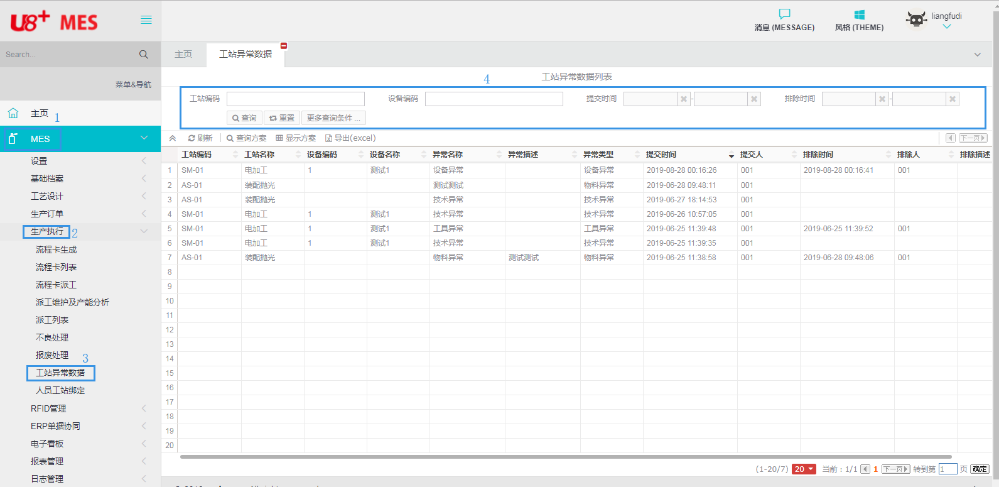

- **操作说明（参照上图）**

1. 点击“MES”,点击“生产执行”，点击“工站异常数据”，进入工站异常数据列表页面；

2. 工站异常数据列表页，列表显示全部的工站异常数据，可以查询工站异常数据，对应操作是“4”；

3. 工站异常数据列表页，列表记录工站设备的异常数据，和异常数据的排除记录。

## 1.7 RFID 管理

### 1.7.1 RFID 设置

1. RFID 标签打印模板

- **菜单路径**

登录 mes3.0—MES—RFID 管理—RFID 设置—RFID 标签打印模板

- **概述**

上传 RFID 标签打印模板

- **操作界面**

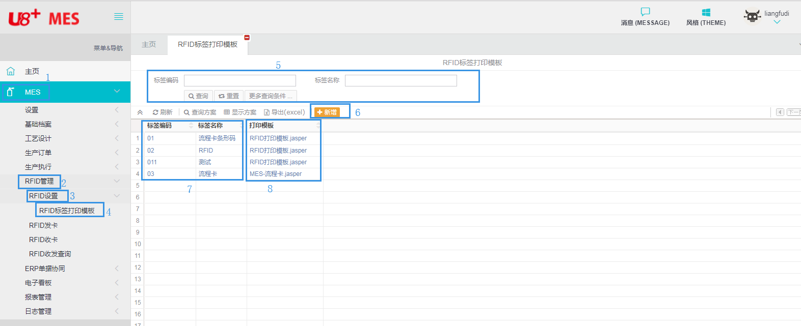

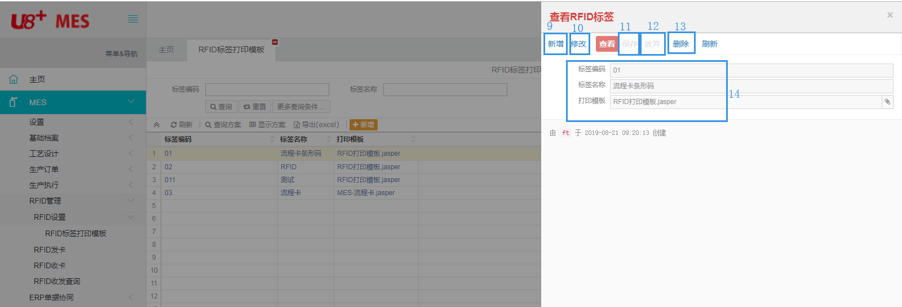

- **操作说明（参照上图）**

1. 点击“MES”,点击“RFID 管理”，点击“RFID 标签打印模板”，进入 RFID 标签打印模板列表页面；

2. RFID 标签打印模板列表页，列表显示全部的 RFID 标签打印模板，可以查询 RFID 标签打印模板，对应操作是“5”；

3. RFID 标签打印模板列表页，点击“新增”弹出 RFID 标签打印模板新增页，对应操作是“6”；

4. RFID 标签打印模板列表页，点击“标签编码”或“标签名称”，会弹出 RFID 标签打印模板的详情页，对应操作是“7”；

5. RFID 标签打印模板列表页，点击“打印模板”会弹出 RFID 标签打印模板可以下载，对应操作是“8”

6. RFID 标签打印模板详情页，点击“新增”，弹出 RFID 标签打印模板的新增页面，对应操作是“9”；

7. RFID 标签打印模板详情页，点击“修改”，修改 RFID 标签打印模板数据，对应操作是“10”；

8. RFID 标签打印模板详情页，点击“保存”，保存修改或新增的 RFID 标签打印模板，对应操作是“11”；

9. RFID 标签打印模板详情页，点击“放弃”，放弃保存修改或新增的 RFID 标签打印模板，对应操作是“12”；

10. RFID 标签打印模板详情页，点击“删除”，删除 RFID 标签打印模板数据，对应的操作是“13”；

11. RFID 标签打印模板详情页，输入或上传标签模板，组成 RFID 标签打印模板的数据，对应的操作是“14”。

### 1.7.2 RFID 发卡

- **菜单路径**

登录 mes3.0—MES—RFID 管理—RFID 发卡

- **概述**

RFID 卡绑定流程卡号，可用 RFID 代替流程卡扫码。

- **操作界面**

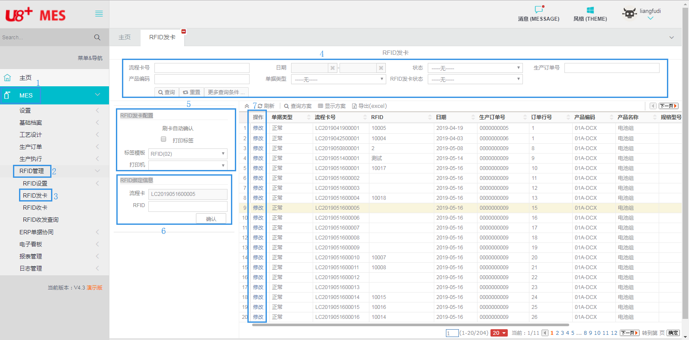

- **操作说明（参照上图）**

1. 点击“MES”,点击“RFID 管理”，点击“RFID 发卡”，进入 RFID 发卡列表页面；

2. RFID 发卡列表页，列表显示全部的流程卡数据，可以查询 R 流程卡，对应操作是“4”；

3. RFID 发卡列表页，RFID 发卡配置，配置 RFID 标签打印模板，对应操作是“5”；

4. RFID 发卡列表页，RFID 绑定信息，绑定 RFID 卡给流程卡，对应操作是“6”；

5. RFID 发卡列表页，点击“修改”，弹出换卡操作，换 RFID 卡，对应操作是“7”；

### 1.7.3 RFID 收卡

- **菜单路径**

登录 mes3.0—MES—RFID 管理—RFID 收卡

- **概述**

回收已发的 RFID 卡。

- **操作界面**

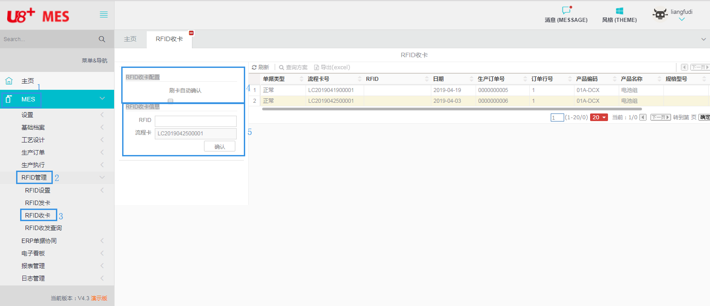

- **操作说明（参照上图）**

1. 点击“MES”,点击“RFID 管理”，点击“RFID 收卡”，进入 RFID 收卡列表页面；

2. RFID 收卡列表页，RFID 收卡配置，勾选刷卡自动确认时，收卡只要回车键，对应操作是“4”；

3. RFID 收卡列表页，RFID 收卡信息，输入 RFID 卡回收，对应操作是“5”。

### 1.7.4 RFID 收发查询

- **菜单路径**

登录 mes3.0—MES—RFID 管理—RFID 收发查询

- **概述**

记录第次 RFID 发卡、RFID 收卡的记录。

- **操作界面**

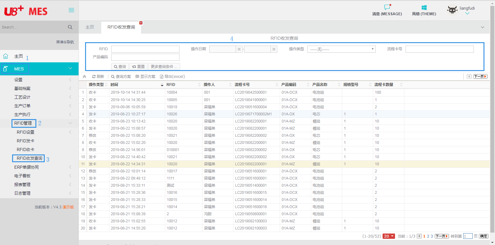

- **操作说明（参照上图）**

1、点击“MES”,点击“RFID 管理”，点击“RFID 收发查询”，进入 RFID 收发查询列表页面；

2、RFID 收发查询列表页，列表显示全部的收发卡记录，可以查询收发卡记录卡，对应操作是“4”；

## 1.8 ERP 单据协同

### 1.8.1 材料出库单生成

- **菜单路径**

登录 mes3.0—MES—ERP 单据协同—材料出库单生成

- **概述**

根据收料记录生成材料出库单、查询材料出库单列表；根据报工记录生成产品入库单、查询产品入库单列表。

- **操作界面**

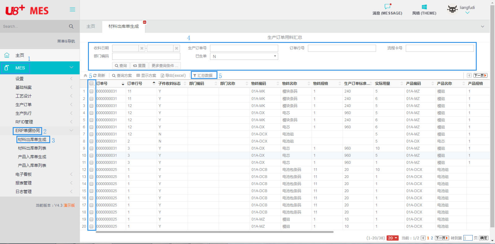

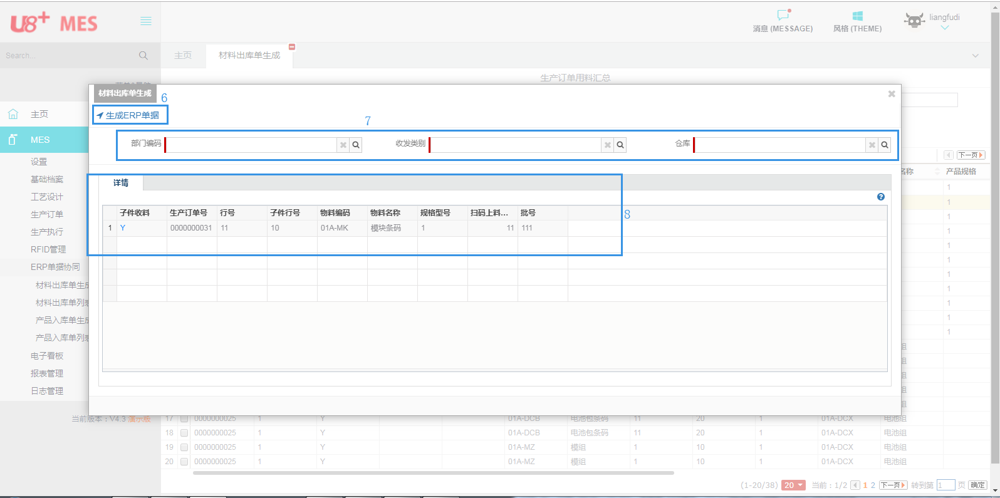

- **操作说明（参照上图）**

1. 点击“MES”,点击“ERP 单据协同”，点击“材料出库单生成”，进入材料出库单生成列表页面；

2. 材料出库单生成列表页，列表显示全部的流程卡数据，可以查询材料出库生成单，对应操作是“4”；

3. 材料出库单生成列表页，选择“领料单”，点击“汇总数据”弹出材料出库单生成页，对应操作是“5”；

4. 材料出库单生成页，点击“生成 ERP 单据”生成 ERP 材料出库单，对应操作是“6”；

5. 材料出库单生成页，参照 U8 数据选择“部门编码”、“收发类别”、“仓库”，对应操作是“7”；

6. 材料出库单生成页，详情显示物料详情信息，对应操作是“8”；

### 1.8.2 材料出库单列表

- **菜单路径**

登录 mes3.0—MES—ERP 单据协同—材料出库单列表

- **概述**

保存记录生成的材料出库单数据。

- **操作界面**

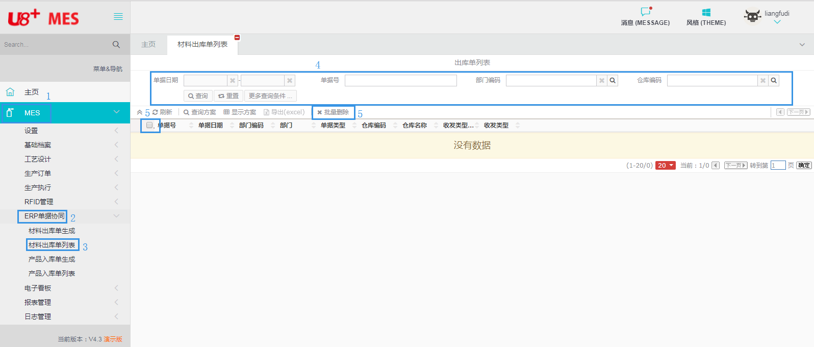

- **操作说明（参照上图）**

1. 点击“MES”,点击“ERP 单据协同”，点击“材料出库单列表”，进入材料出库单列表页面；

2. 材料出库单列表页，列表显示在 MES 系统做的全部材料出库单，可以查询材料出库单，对应操作是“4”；

3、材料出库单列表页，选择“材料出库单”，点击“批量删除”删除材料出库单数据，对应操作是“5”，数据会回写；

### 1.8.3 产品入库单生成

- **菜单路径**

登录 mes3.0—MES—ERP 单据协同—产品入库单生成

- **概述**

根据完工的流程卡的生产订单，生成产品入库单。

- **操作界面**

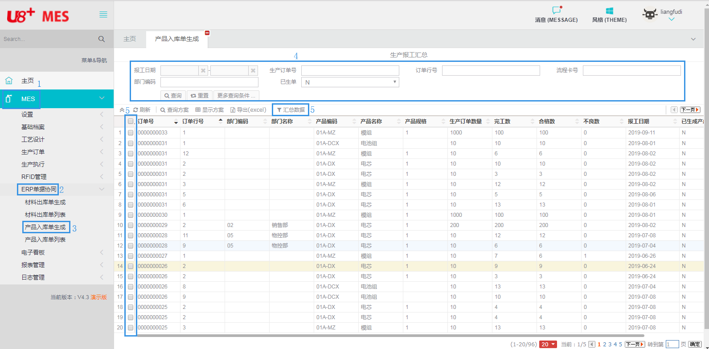

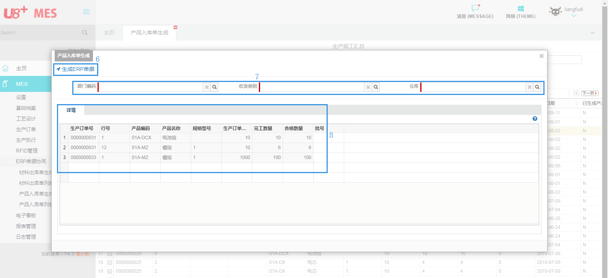

- **操作说明（参照上图）**

1、点击“MES”,点击“ERP 单据协同”，点击“产成品入库单生成”，进入产成品入库单生成列表页面；

2、产成品入库单生成列表页，列表显示全部的完工生产订单数据，可以查询完工生产订单数据，对应操作是“4”；

3、产成品入库单生成列表页，选择“完工生产订单”，点击“汇总数据”弹出产成品入库单生成页，对应操作是“5”；

4、产成品入库单生成页，点击“生成 ERP 单据”生成 ERP 产成品入库单，对应操作是“6”；

5、产成品入库单生成页，参照 U8 数据选择“部门编码”、“收发类别”、“仓库”，对应操作是“7”；

6、产成品入库单生成页，详情显示订单详情信息，对应操作是“8”；

### 1.8.4 产品入库单列表

- **菜单路径**

登录 mes3.0—MES—ERP 单据协同—产品入库单列表

- **概述**

保存记录生成的产成品入库单数据。

- **操作界面**

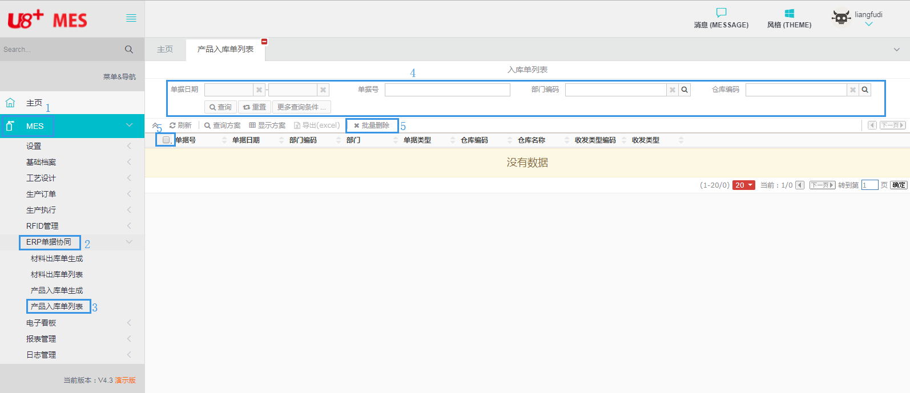

- **操作说明（参照上图）**

1、点击“MES”,点击“ERP 单据协同”，点击“产成品入库单列表”，进入产成品入库单列表页面；

2、产成品入库单列表页，列表显示全部的 MES 系统做的产成品入库单，可以查询产成口入库单，对应操作是“4”；

3、产成品入库单列表页，选择“产成品入库单”，点击“批量删除”删除产成品入库单数据，对应操作是“5”，数据会回写；

## 1.9 电子看板

### 1.9.1 产线看板

- **菜单路径**

登录 mes3.0—MES—电子看板—产线看板

- **概述**

根据过滤条件（部门/工作中心）显示所有工站，根据生产派工列表来统计派工数量、派工工时，根据生产报工明细统计完成情况。

- **操作界面**

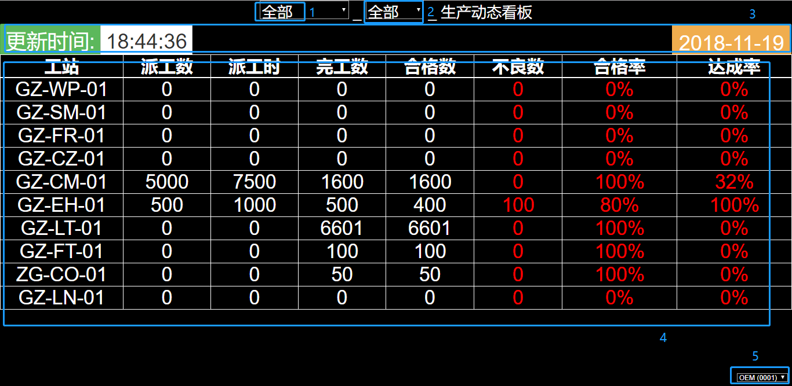

- **操作说明（参照上图）**

1. 选择“部门”，对应操作“1”；

2. 选择“工站”，对应操作“2”；

3. 服务器当前日期和时间，即最新跟新时间，对应操作“3”；

4. 看板显示的内容，对应操作“4”；

5. 选择“账套”，对应账套信息，对应操作“5”；

- **数据逻辑关系：**

1. 数据以报工数据为主，派工信息为辅；当报工信息不存在时，不会显示派工信息

2. 工站：过滤 部门+工作中心 下的工站

3. 派工数量
   已报工数据对应工站的派工数量合计；由于派工仅派到工序，若存在同工序对应多个工站，则数据是相同的；

4. 派工工时
   已报工数据对应工站的派工工时合计；由于派工仅派到工序，若存在同工序对应多个工站，则数据是相同的；

5. 完工数量=合格数+不良数

6. 合格数=合格数+转出-转入

7. 不良数=不良数+转入-转出

8. 合格率=合格数\*100/完工数 取整

9. 达成率=完工数\*100/派工数 取整

### 1.9.2 收料看板

- **菜单路径**

登录 mes3.0—MES—电子看板—收料看板

- **概述**

根据过滤条件（部门/工作中心）显示所有工站的收料情况。

- **操作界面**

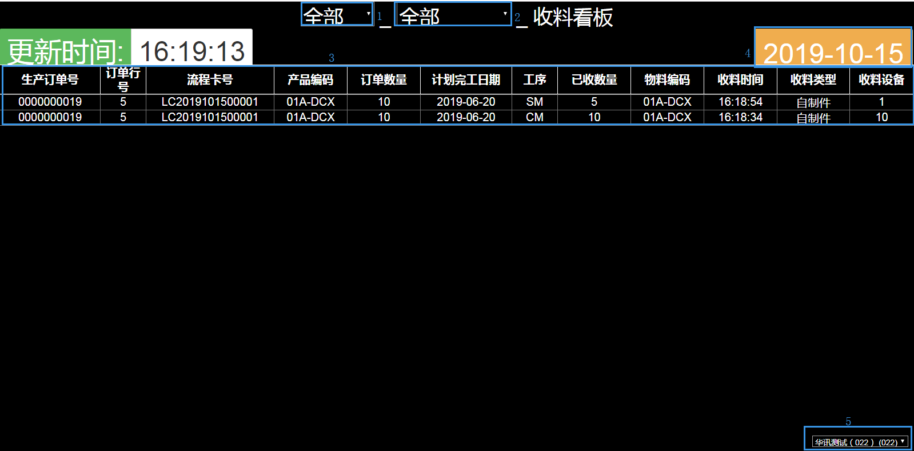

- **操作说明（参照上图）**

1、选择“部门”，对应操作“1”；

2、选择“工站”，对应操作“2”；

3、服务器当前日期和时间，即最新跟新时间，对应操作“3”；

4、看板显示的内容，对应操作“4”；

5、选择“账套”，对应账套信息，对应操作“5”；

### 1.9.3 工序看板

- **菜单路径**

登录 mes3.0—MES—电子看板—工序看板

- **概述**

根据过滤条件（部门/工作中心）显示所有工站的工序的完工数情况。

- **操作界面**

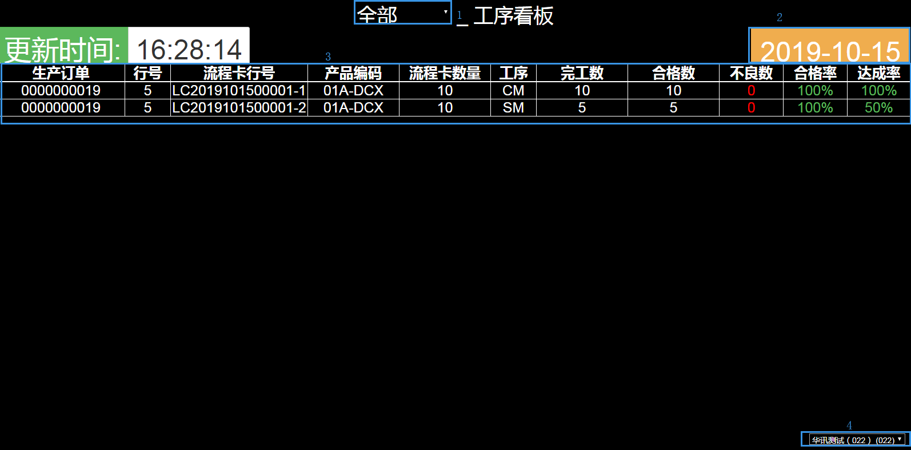

- **操作说明（参照上图）**

1. 选择“工站”，对应操作“1”；

2. 服务器当前日期和时间，即最新跟新时间，对应操作“2”；

3. 看板显示的内容，对应操作“3”；

4. 选择“账套”，对应账套信息，对应操作“4”；

### 1.9.4 车间看板

- **菜单路径**

登录 mes3.0—MES—电子看板—车间看板

- **概述**

车间执行分析看板，用来统计车间/工作中心 生产任务的完成情况。

- **操作界面**

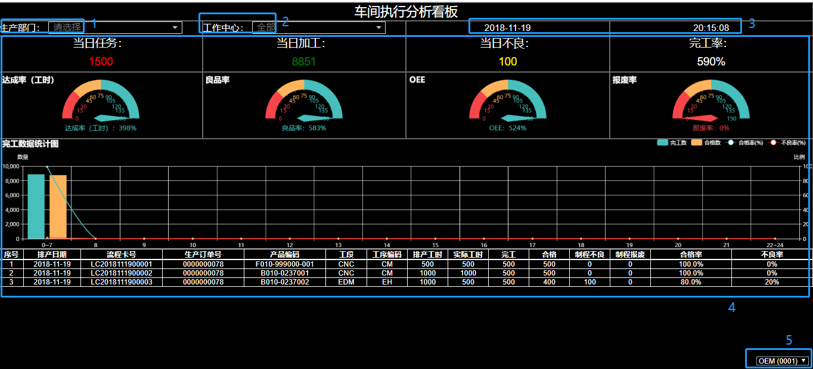

- **操作说明（参照上图）**

1. 选择“生产部门”，对应操作“1”；

2. 选择“工作中心”，对应操作“2”；

3. 最近更新数据的日期和时间，对应操作“3”；

4. 实时更新的看板内容，对应操作“4”；

5、选择账套，选择 ERP 中的那个账套信息，对应操作“5”。

- **数据逻辑关系:**

1. 当日任务：派工总数

2. 当日加工：完工总数

3. 当日不良：不良总数

4. 完工率：完工总数\*100/当日总数 取整

5. 达成率(工时)：完工工时\*100/派工工时 取整

6. 良品率：合格数量\*100/完工数量 取整

7. 设备利用率：报工工时\*100/每日可利用工时（指定部门/工作中心的所有资源档案中“资源类型=设备”
   的 '每日可利用工时'之和）

8. 报废率：处理结果为报废的不良品数量之和\*100/当日完工数量 ,取整

9. 完工数据统计图:查看各个时段报工统计数据

10、查询时间内派工数据及加工情况；若无派工，则不显示

### 1.9.5 订单看板

- **菜单路径**

登录 mes3.0—MES—电子看板—订单看板

- **概述**

订单看板，用来显示生产订单的报工完工情况和数据统计。

- **操作界面**

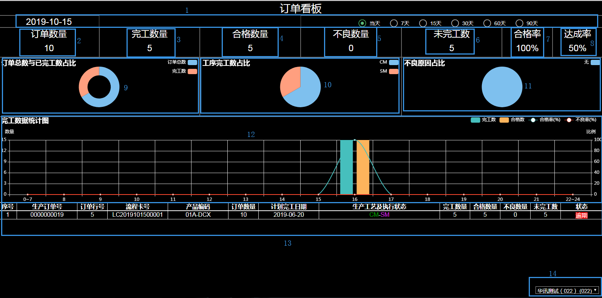

- **操作说明（参照上图）**

1. 显示当天日期，可以选择近期的天数显示，对应操作是“1”；

2. 订单数量，显示所选的天数的订单数量总数，对应操作是“2”；

3. 完工数量，显示所选的天数的完工数量总数，对应操作是“3”；

4. 合格数量，显示所选的天数的合格数量总数，对应操作是“4”；

5. 不良数量，显示所选的天数的不良数量总数，对应操作是“5”；

6. 未完工数，显示所选的天数的未完工数总数，对应操作是“6”；

7. 合格率=（合格数量/完工数量）\*100%，对应操作是“7”；

8. 达成率=（完式数/订单数量）\*100%，对应操作是“8”；

9. 订单总数与已完工数占的比率显示，对应操作是“9”；

10. 工序完工式数占的比率显示，有报工的工序都能占一份比率，对应操作是“10”；

11. 不良原因占的比率显示，不良数量做了不良处理后的原因占的比率显示，对应操作是“11”；

12. 完工数据统计图，显示生产订单在一天中的哪个时间段执行的显示，对应的操作是“12”；

13. 列表显示做过的生产订单信息，对应操作是“13”；

14. 选择账套，对应操作“5”。

### 1.9.6 质检看板

- **菜单路径**

登录 mes3.0—MES—电子看板—质检看板

- **概述**

可以查看：当天、7、15、30、60、90 天品质统计分析数据，以便监控质量异常，作出改善。

- **操作界面**

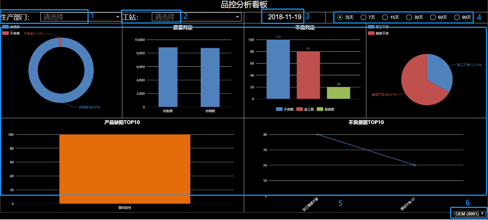

- **操作说明（参照上图）**

1. 选择“生产部门”，对应操作“1”；

2. 选择“工站”，对应操作“2”；

3. 当前日期，对应操作“3”；

4. 选择当前日期前多少天的时间段（当天、7、15、30、60、90）来统计，对应操作“4”；

5. 实时更新的看板内容，对应操作“5”；

6. 选择“账套号”，对应 ERP 那个账套的信息，对应操作“6”。

- **数据逻辑关系:**

1、第一图，合格率、不良率比例。；合格率=合格数/总产量，不良率=不合格数/总产量，

2、第二图，质量判定。检验数（=报工数），合格数（报工的合格数）

3、第三图，返工、报废柱状图；不良数=报工不良数之和；返工数=过滤的不良待处理任务，数量之和；报废数=过滤报废待处理任务中，数量之和

4、不良处理，原因分类(大类)统计；不良/报废待处理任务中，按照选择的“不良原因对应分类”进行统计

5、产品缺陷 top10
产品不良数统计；不良/报废待处理任务中，按照产品进行分类统计，取数量最大的 10 个产品

6、不良原因 top10
不良原因分类统计(小类)；不良/报废待处理任务中，按照选择的“不良原因”进行统计，取数量最大的 10 个不良原因

### 1.9.7 异常看板

- **菜单路径**

登录 mes3.0—MES—电子看板—异常看板

- **概述**

根据过滤条件（部门/工作中心）统计异常数据，采取预防措施或对应策略。

- **操作界面**

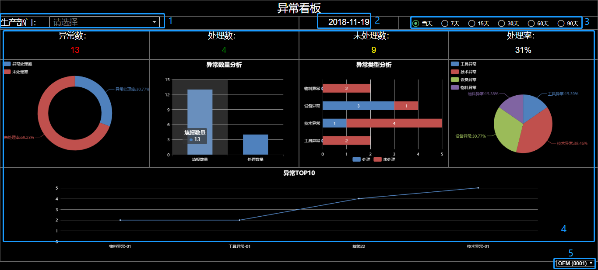

- **操作说明（参照上图）**

1. 选择“生产部门”，对应操作“1”；

2. 当前日期，对应操作“2”；

3. 选择当前日期前多少天的时间段（当天、7、15、30、60、90）来统计，对应操作“3”；

4. 实时更新的看板内容，对应操作“4”；

5. 选择“账套号”，对应 ERP 那个账套的信息，对应操作“5”。

- **数据逻辑关系:**

以异常上报时间进行过滤，（生产部门-\>工作中心-\>工站-\>设备）

1.异常数：报工页面参数时间内的异常报告总数

2.处理数：已排除的数量

3.未处理数：异常数-处理数

4.处理率-处理数：未处理数

5.异常数量分析：异常数，处理数

6.异常类型分析

7.异常类型比率

8.异常 TOP10

### 1.9.8 生产执行综合分析

- **菜单路径**

登录 mes3.0—MES—电子看板—生产执行综合分析

- **概述**

本功能用于分析一段时间（当天、7、15、30、60、90）内的设备产能利用率、生产任务达成率和设备产能利用分析。实时显示设备利用率和生产任务的达成率。

- **操作界面**

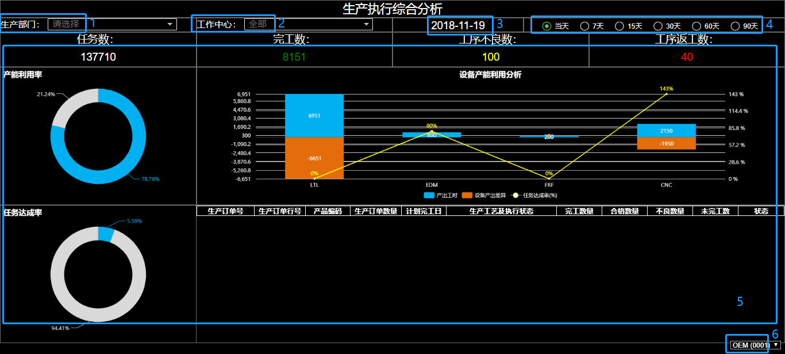

- **操作说明（参照上图）**

1. 选择“生产部门”，对应操作“1”；

2. 选择“工作中心”，对应操作“2”；

3. 当前日期，对应操作“3”；

4. 选择当前日期前多少天的时间段（当天、7、15、30、60、90）来统计，对应操作“4”；

5. 实时更新的看板内容，对应操作“5”；

6. 选择“账套号”，对应 ERP 那个账套的信息，对应操作“6”。

- **数据逻辑关系:**

过滤条件为生产部门及当时所在工作中心

1、任务数=存在报工数据的流程卡表头数量之和

2、完工数=统计全流程卡工序都做完的数量，最后一工序报工日期统计

3、工序不良数= 统计流程卡各工序不良数量，以工序报工日期滤

4、工序返工数=不良待处理任务.不良数量，之和，且处理结果=返工的（不过滤是否生成返工流程卡）

5、产能利用率= （报工总数\*标准工时）/资源设备产能之和

6、设备产能利用分析：

资源组列：部门-工作中心,下用到的资源组

产出工时：资源对应工序的报工总数\*标准工时

设备产出的差异：资源对应产能-产出工时(结果可能为负)

任务达成率： 产出工时\*100/工序派工工时

7、任务达成率 = 完工数/ 任务数 (以流程卡数量为维度)

8、流程卡执行状态: 按照订单交期过滤，资源所在部门工作中心对应的流程卡

完工数=流程最后工序报工数

不良数=流程卡总不良数

合格数=完工-不良

未完工数=流程卡数量-完工数-不良数

状态判断依据：

完工=所有工序完成，且所有工序最后一天完日期在计划完工日期之前或=计划完工日期；

延期完工=所有工序完成，且最后一天完日期在计划完工日期之后；

逾期=所有工序没有完成，且计划完工日期\<今天

在制=首工序已开工、或已上料，且且计划完工日期\>今天

完工数量=流程卡最后一道工序合格数+流程卡总不良数

### 1.9.9 资源任务执行分析

- **菜单路径**

登录 mes3.0—MES—电子看板—资源任务执行分析

- **概述**

本功能用于分析一段时间（当天、7、15、30、60、90）内的设备产能利用率、生产任务达成率和设备产能利用分析。实时显示设备利用率和生产任务的达成率。

- **操作界面**

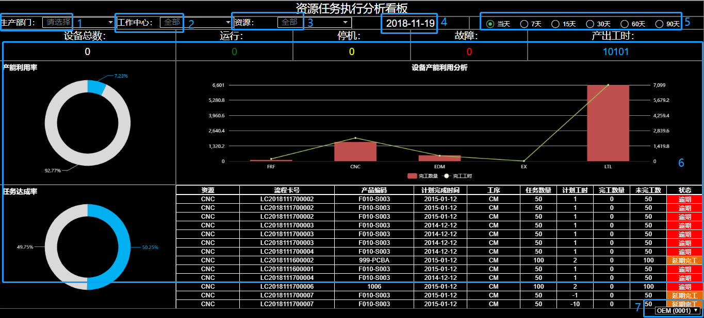

- **操作说明（参照上图）**

1. 选择“生产部门”，对应操作“1”；

2. 选择“工作中心”，对应操作“2”；

3. 选择“资源”，对应操作“3”；

4. 当前日期，对应操作“4”；

5. 选择当前日期前多少天的时间段（当天、7、15、30、60、90）来统计，对应操作“5”；

6. 实时更新的看板内容，对应操作“6”；

7. 选择“账套号”，对应 ERP 那个账套的信息，对应操作“7”。

- **数据逻辑关系:**

1、设备总数=过滤资源下的设备个数

2、运行：过滤出来的设备状态=‘开机’

3、停机：过滤出来的设备状态=‘停机’

4、故障：过滤出来的设备状态=‘故障’

5、产出工时：资源对应工序总报工数\*标准工时

6、产能利用率=产出工时：资源总产能

7、任务达成率=产出工时：资源对应工序日期范围内派工工时之和

8、资源产能利用分析：

列：部门-工作中心-资源组 过滤出的所有资源组

完工数量：资源对应工序时间段内的报工数量

完工工时：资源对应工序时间段内的报工工时

1. 流程卡行详情；

资源:按参数过滤的出流程行对应的资源

任务数量：流程卡行数量

标准工时：流程卡行的标准工时

完工数量：流程卡行的报工数合计（跟报工时间无关）

未完工数：任务数量-完工数量

状态:流程卡行的状态：

完工=所有工序完成，且所有工序最后一天完日期在计划完工日期之前或=计划完工日期；

延期完工=所有工序完成，且最后一天完日期在计划完工日期之后；

逾期=所有工序没有完成，且计划完工日期\<今天

在制=首工序已开工、或已上料，且且计划完工日期\>今天

### 1.9.10 工厂状态仿真看板

- **菜单路径**

登录 mes3.0—MES—电子看板—工厂状态仿真看板

- **概述**

根据导入的设备位置底图，将 MES 系统中的设备与具体的位置在底图中用图标对应。实时读取设备状态和监听工站的异常报告，若正常，则图标无异常显示；若发生异常，则图标会闪烁、图标底框为红色，外接扬声器会响起警报声。此看板能实施查看全厂设备的实时状态：工作、停机、故障。

- **操作界面**

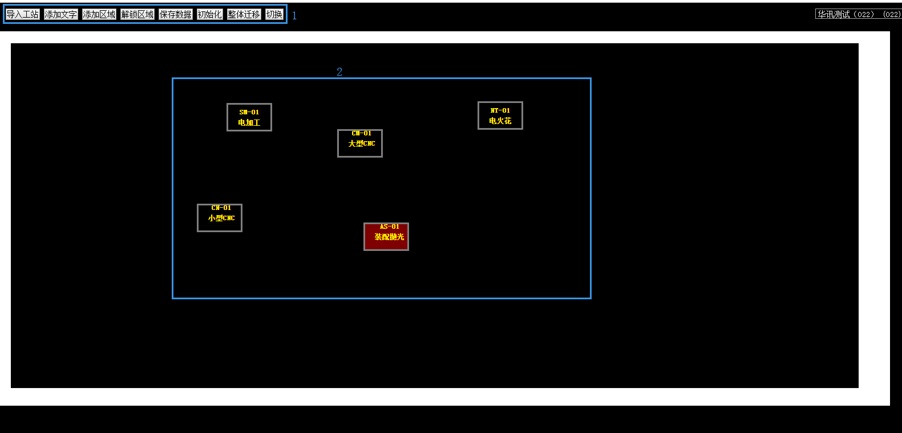

- **操作说明（参照上图）**

1. 导入工站、添加文字、添加区域、解锁区域、保存数据、初始化、整体迁移、切换，一系列操作，对应的操作是“1”；

2. 显示内容，对应操作是“2”；

## 1.10 报表管理

### 1.10.1 生产收料明细表

- **菜单路径**

登录 mes3.0—MES—报表管理—生产收料明细表

- **概述**

生产收料明细表记录流程卡在工站“收料”的明细表。

- **操作界面**

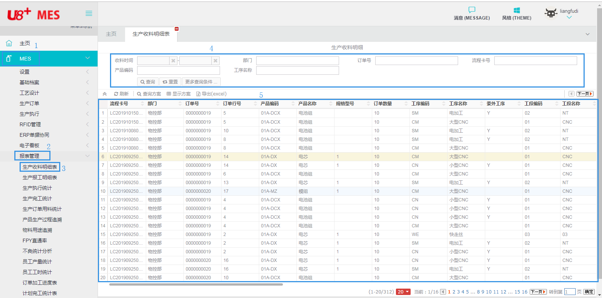

- **操作说明（参照上图）**

1、点击“MES”,点击“报表管理”，点击“生产收料明细表”，进入生产收料明细表列表页面；

2、生产收料明细表列表页，列表记录显示全部的生产收料明细表，可以查询生产收料明细，对应操作是“4”；

3、生产收料明细表列表页，列表显示流程卡的收料明细，对应操作是“5”。

### 1.10.2 生产报工明细表

- **菜单路径**

登录 mes3.0—MES—报表管理—生产报工明细表

- **概述**

生产报工明细表记录流程卡在工站“报工”的明细表。

- **操作界面**

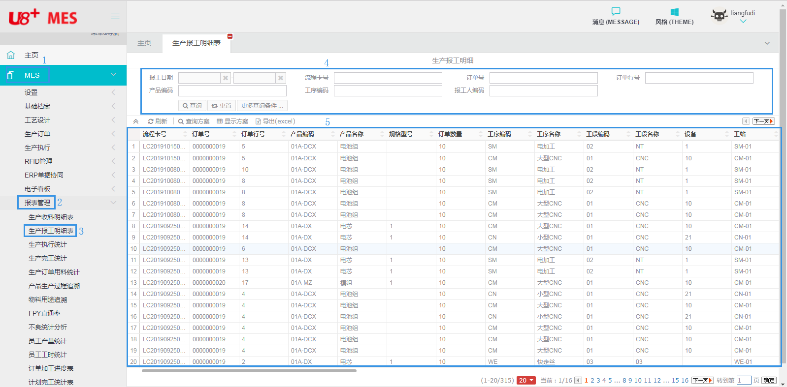

- **操作说明（参照上图）**

1、点击“MES”,点击“报表管理”，点击“生产报工明细表”，进入生产报工明细表列表页面；

2、生产报工明细表列表页，列表记录显示全部的生产报工明细表，可以查询生产报工明细，对应操作是“4”；

3、生产报工明细表列表页，列表显示流程卡的报工明细，对应操作是“5”。

### 1.10.3 生产执行统计

- **菜单路径**

登录 mes3.0—MES—报表管理—生产执行统计

- **概述**

生产执行统计报表显示还没有完工的流程卡数据，查看流程卡做到哪个工序的数据。

- **操作界面**

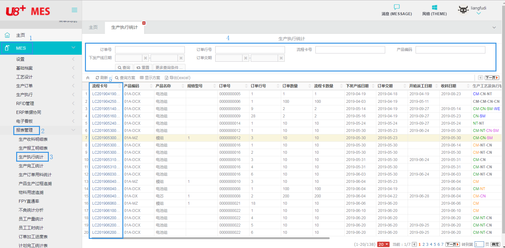

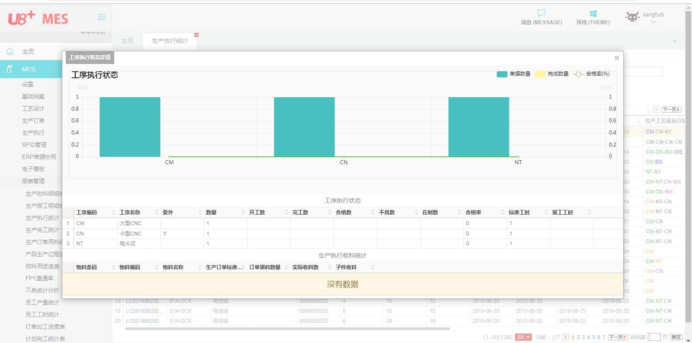

- **操作说明（参照上图）**

1. 点击“MES”,点击“报表管理”，点击“生产执行统计”，进入生产执行统计列表页面；

2. 生产执行统计列表页，列表记录显示未完工的流程卡数据，可以查询未完工的流程卡数据，对应操作是“4”；

3. 生产执行统计列表页，点击“流程卡号”，弹出工序执行状态详情页，对应操作是“5”。

### 1.10.4 生产完工统计

- **菜单路径**

登录 mes3.0—MES—报表管理—生产完工统计

- **概述**

生产完工统计，统计每天的排产工时、加工工时、标准加工工时、完工数量、合格数量、制程不良、制程报废、合格率、不良率、排产达成率的数据，并用柱状统计图显示出来。

- **操作界面**

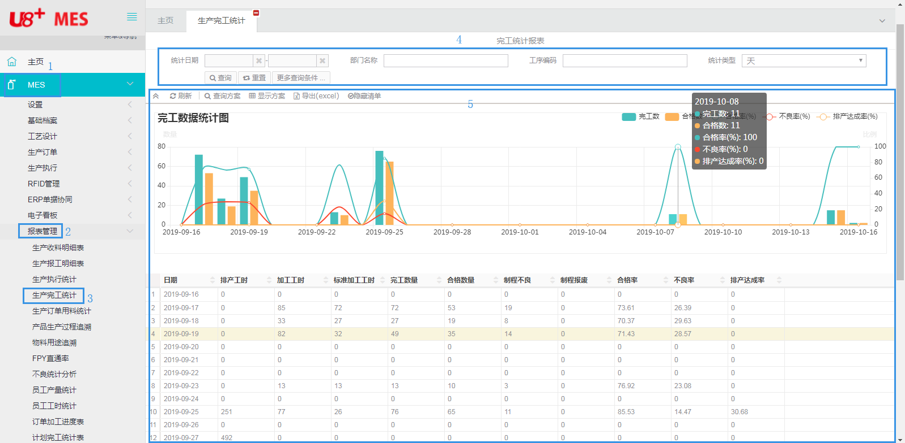

- **操作说明（参照上图）**

1. 点击“MES”，点击“报表管理”，点击“生产报工明细表”，进入生产完工统计报表页；

2. 生产完工统计报表页，列表记录显示每天的完工情况，可以查询数据，对应操作是“4”；

3. 生产完工统计报表页，显示每天的完工情况，对应操作是“5”；

### 1.10.5 生产订单用料统计

- **菜单路径**

登录 mes3.0—MES—报表管理—生产订单用料统计

- **概述**

生产订单用料统计记录生产订单的用料统计。

- **操作界面**

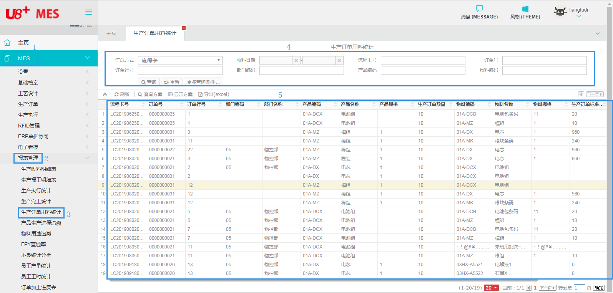

- **操作说明（参照上图）**

1、点击“MES”,点击“报表管理”，点击“生产订单用料统计”，进入生产订单用料统计列表页面；

2、生产订单用料统计列表页，列表记录显示生产订单用料统计，可以查询生产订单用料统计数据，对应操作是“4”；

3、生产订单用料统计列表页，列表显示生产订单用料统计数据，对应操作是“5”。

### 1.10.6 产品生产过程追溯

- **菜单路径**

登录 mes3.0—MES—报表管理—产品生产过程追溯

- **概述**

产品生产过程追溯可以根据流程卡展开查看生产订单的生产执行过程。

- **操作界面**

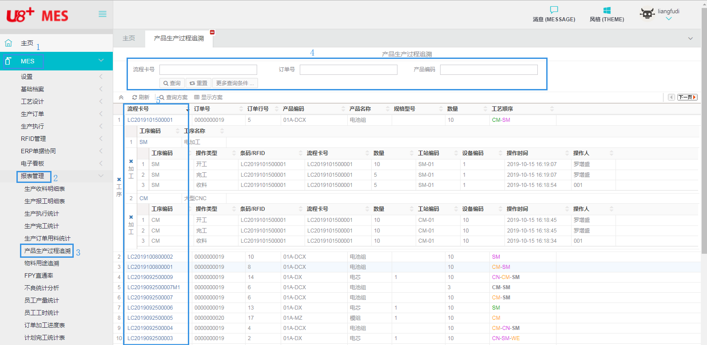

- **操作说明（参照上图）**

1、点击“MES”,点击“报表管理”，点击“产品生产过程追溯”，进入产品生产过程追溯列表页面；

2、产品生产过程追溯列表页，列表记录显示全部的产品生产过程追溯，可以查询产品生产过程追溯数据，对应操作是“4”；

3、产品生产过程追溯列表页，点击列表的“流程卡号”，展开查看生产执行的操作过程，对应操作是“5”。

### 1.10.7 物料用途追溯

- **菜单路径**

登录 mes3.0—MES—报表管理—物料用途追溯

- **概述**

物料用途追溯，根据条码查询追溯物料的用途。

- **操作界面**

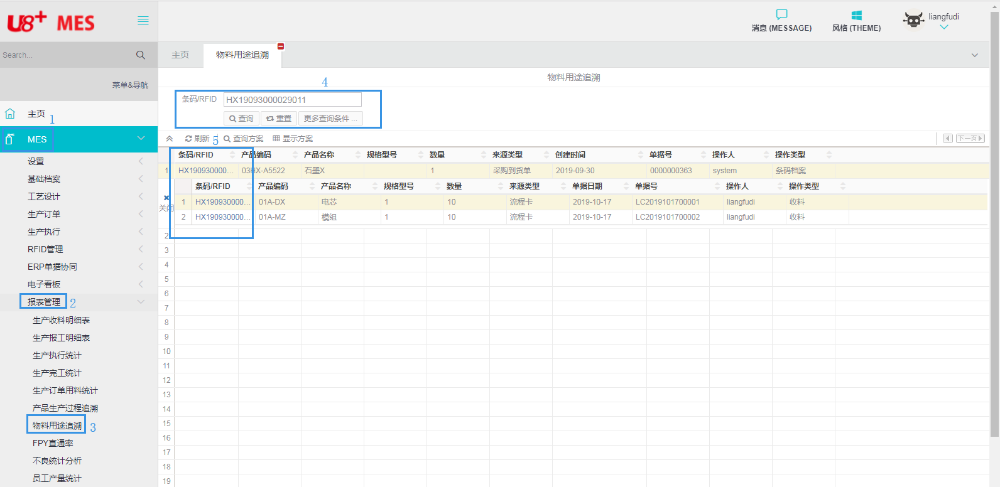

- **操作说明（参照上图）**

1、点击“MES”,点击“报表管理”，点击“物料用途追溯”，进入物料用途追溯列表页面；

2、物料用途追溯列表页，根据查询物料条码或 RFID，查询物料用途追溯数据，对应操作是“4”；

3、物料用途追溯列表页，点击列表中的“条码/RFID”号，展开物料条码的用途记录，对应操作是“5”。

### 1.10.8 FPY 直通率

- **菜单路径**

登录 mes3.0—MES—报表管理—FPY 直通率

- **概述**

FPY 直通率报表，显示产品的 FPY 直通率的情况。

- **操作界面**

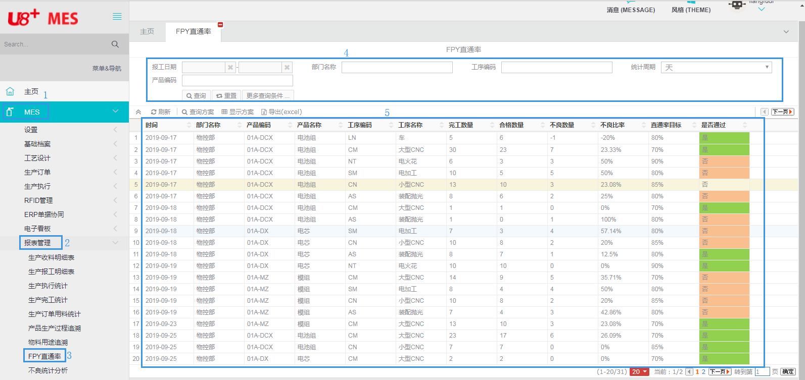

- **操作说明（参照上图）**

1、点击“MES”,点击“报表管理”，点击“FPY 直通率”，进入 FPY 直通率列表页面；

2、FPY 直通率列表页，列表记录显示全部的 FPY 直通率，可以查询 FPY 直通率数据，对应操作是“4”；

3、FPY 直通率列表页，列表显示 FPY 直通率数据，对应操作是“5”。

### 1.10.9 不良统计分析

- **菜单路径**

登录 mes3.0—MES—报表管理—不良统计分析

- **概述**

统计分析生产过程中的不良数据。

- **操作界面**

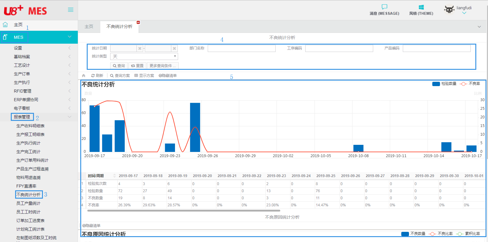

- **操作说明（参照上图）**

1、点击“MES”,点击“报表管理”，点击“不良统计分析”，进入不良统计分析列表页面；

2、不良统计分析列表页，列表记录显示全部的不良统计分析，可以查询不良统计分析数据，对应操作是“4”；

3、不良统计分析列表页，列表显示不良统计分析数据，对应操作是“5”。

### 1.10.10 员工产量统计

- **菜单路径**

登录 mes3.0—MES—报表管理—员工产量统计

- **概述**

员工产量统计，统计员工每天的报工产量。

- **操作界面**

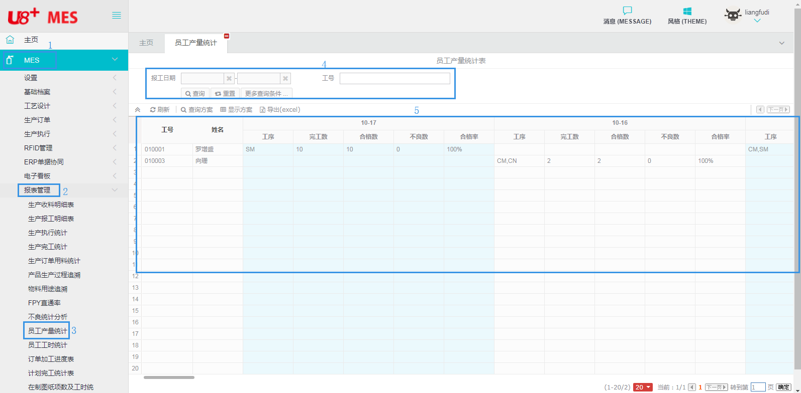

- **操作说明（参照上图）**

1、点击“MES”,点击“报表管理”，点击“员工产量统计”，进入员工产量统计列表页面；

2、员工产量统计列表页，列表记录显示全部的员工产量统计，可以查询员工产量统计数据，对应操作是“4”；

3、员工产量统计列表页，列表显示员工产量统计数据，对应操作是“5”。

### 1.10.11 员工工时产量统计

- **菜单路径**

登录 mes3.0—MES—报表管理—员工工时产量统计

- **概述**

员工工时产量统计，员工的每天报工工时统计。

- **操作界面**

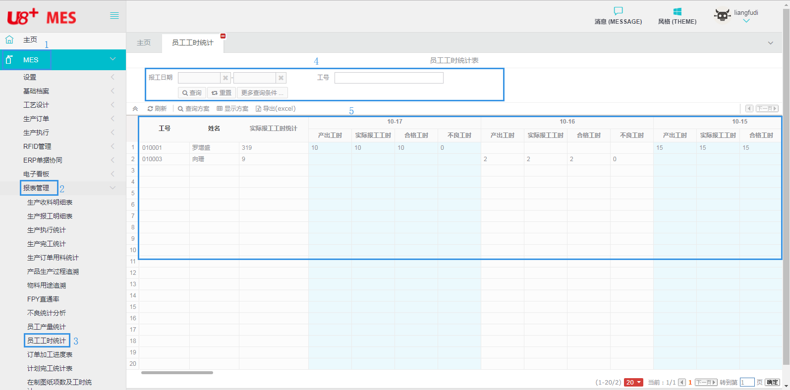

- **操作说明（参照上图）**

1、点击“MES”,点击“报表管理”，点击“员工工时产量统计”，进入员工工时产量统计列表页面；

2、员工工时产量统计列表页，列表记录显示全部的员工工时产量统计，可以查询员工工时产量统计数据，对应操作是“4”；

3、员工工时产量统计列表页，列表显示员工工时产量统计数据，对应操作是“5”。

### 1.10.12 订单加工进度表

- **菜单路径**

登录 mes3.0—MES—报表管理—订单加工进度表

- **概述**

订单加工进度表，记录订单加工进度的详情。

- **操作界面**

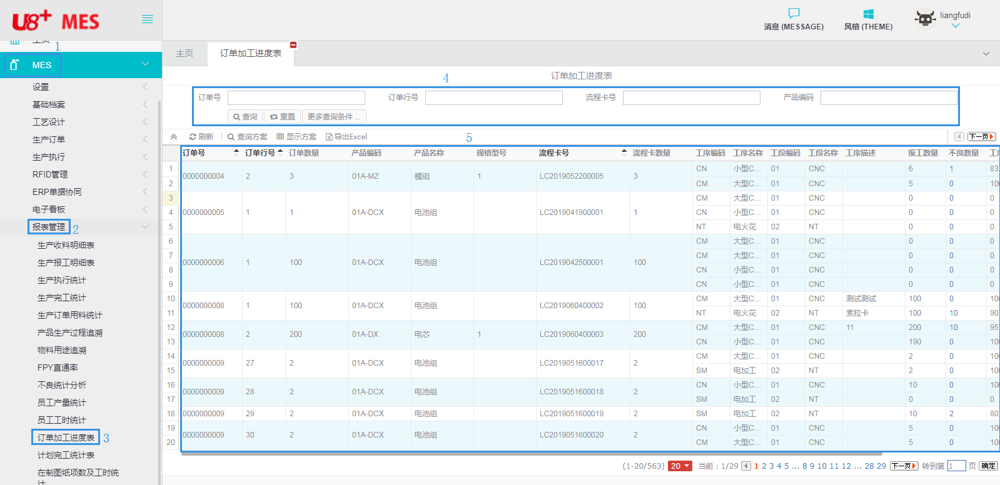

- **操作说明（参照上图）**

1、点击“MES”,点击“报表管理”，点击“订单加工进度表”，进入订单加工进度表列表页面；

2、订单加工进度表列表页，列表记录显示全部的订单加工进度表，可以查询订单加工进度表数据，对应操作是“4”；

3、订单加工进度表列表页，列表显示订单加工进度表数据，对应操作是“5”。

### 1.10.13 计划完工统计表

- **菜单路径**

登录 mes3.0—MES—报表管理—计划完工统计表

- **概述**

计划完工统计表，显示一周内的计划工时、完成工时数据。

- **操作界面**

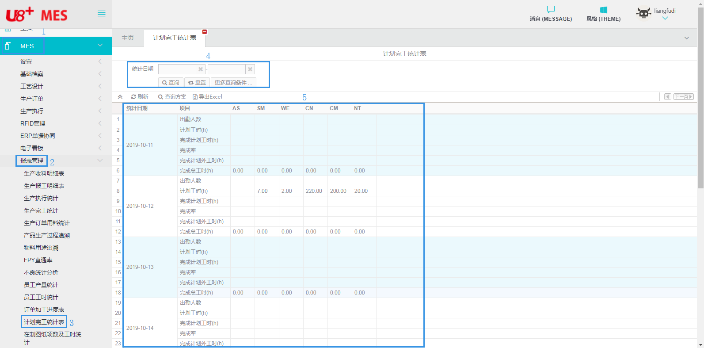

- **操作说明（参照上图）**

1、点击“MES”,点击“报表管理”，点击“计划完工统计表”，进入计划完工统计表列表页面；

2、计划完工统计表列表页，列表记录显示全部的计划完工统计表，可以查询计划完工统计表数据，对应操作是“4”；

3、计划完工统计表列表页，列表显示计划完工统计表数据，对应操作是“5”。

### 1.10.14 在制图纸项数及工时统计

- **菜单路径**

登录 mes3.0—MES—报表管理—在制图纸项数及工时统计

- **概述**

在制图纸项数及工时统计，统计工序的在制情况。

- **操作界面**

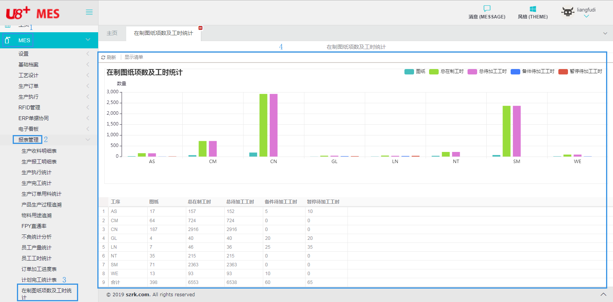

- **操作说明（参照上图）**

1. 点击“MES”,点击“报表管理”，点击“在制图纸项数及工时统计”，进入在制图纸项数及工时统计列表页面；

3、在制图纸项数及工时统计列表页，列表显示在制图纸项数及工时统计数据，对应操作是“4”。

### 1.10.15 生产能力统计表

- **菜单路径**

登录 mes3.0—MES—报表管理—生产能力统计表

- **概述**

生产能力统计表，根据工序的排产工时和日产能利用率工序的周利用率等数据。

- **操作界面**

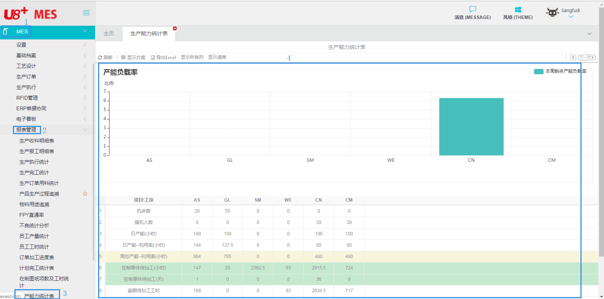

- **操作说明（参照上图）**

1. 点击“MES”,点击“报表管理”，点击“生产能力统计表”，进入生产能力统计表列表页面；

2. 生产能力统计表列表页，列表显示生产能力统计表数据，对应操作是“4”。

### 1.10.16 外发清单

- **菜单路径**

登录 mes3.0—MES—报表管理—外发清单

- **概述**

外发清单记录生产订单外包的记录。

- **操作界面**

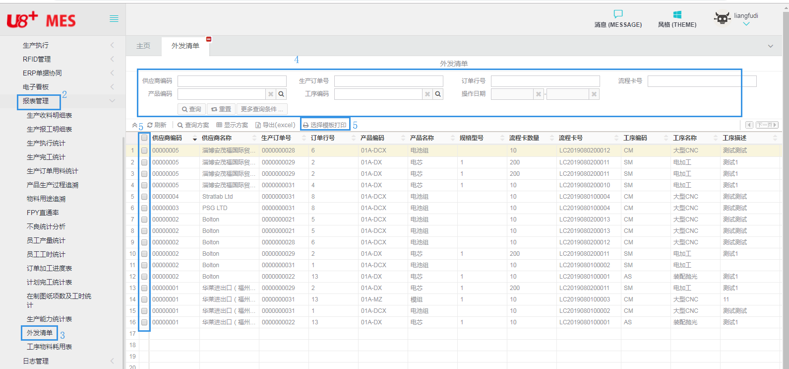

- **操作说明（参照上图）**

1、点击“MES”,点击“报表管理”，点击“外发清单”，进入外发清单列表页面；

2、外发清单列表页，列表记录显示全部的外发清单，可以查询外发清单数据，对应操作是“4”；

3、外发清单列表页，选择“外发清单”，点击“选择模板打印”，打印外发清单数据，对应操作是“5”。

### 1.10.17 工序物料耗用表

- **菜单路径**

登录 mes3.0—MES—报表管理—工序物料耗用表

- **概述**

工序物料耗用表，记录工序耗用物料的详情。

- **操作界面**

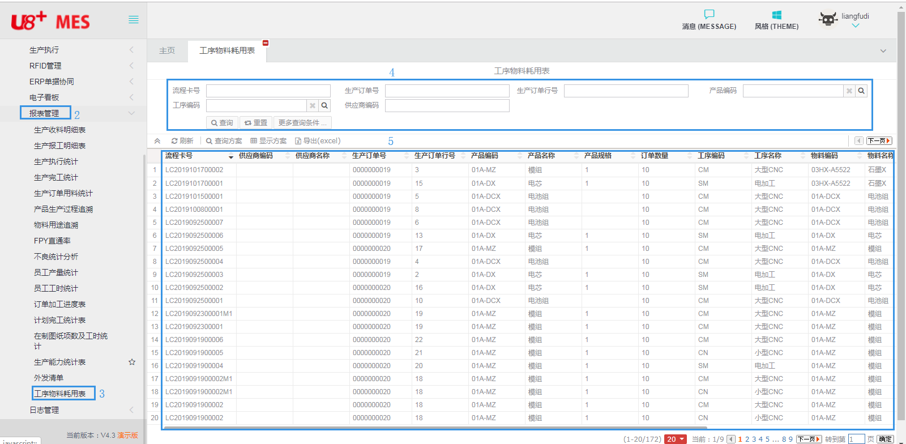

- **操作说明（参照上图）**

1、点击“MES”,点击“报表管理”，点击“工序物料耗用表”，进入工序物料耗用表列表页面；

2、工序物料耗用表列表页，列表记录显示全部的工序物料耗用表，可以查询工序物料耗用表数据，对应操作是“4”；

3、工序物料耗用表列表页，列表显示工序物料耗用表数据，对应操作是“5”。

### 1.10.18 报工工艺参数明细

- **菜单路径**

登录 mes3.0—MES—报表管理—报工工艺参数

- **概述**

记录报工的工艺参照明细

- **操作界面**

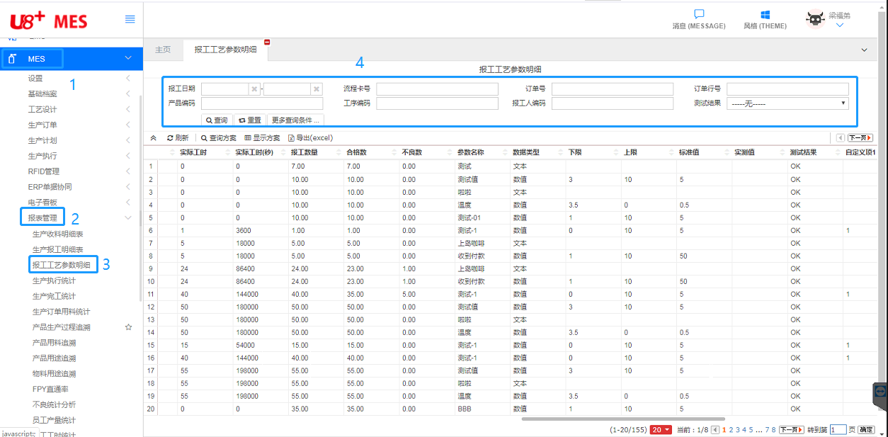

- **操作说明（参照上图）**

1. 点击“MES”,点击“报表管理”，点击“报工工艺参数明细”，进入报工工艺明细列表页；

2. 报工工艺明细列表页，列表记录报工的工艺参数明细，可以查询，对应操作是“4”；

### 1.10.19 产品用料追溯

- **菜单路径**

登录 mes3.0—MES—报表管理—产品用料追溯

- **概述**

记录流程卡用了哪个流程卡进行收料，展开显示。

- **操作界面**

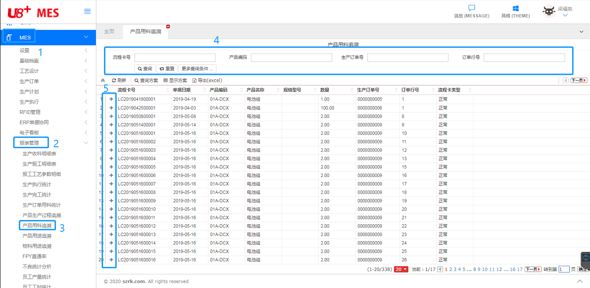

- **操作说明（如上图）**

1. 点击“MES”,点击“报表管理”，点击“产品用料追溯”，进入产品用料追溯页面；

2. 产品用途追料页面，可以查询流程卡在收了哪流程卡上收料处理，对应操作是“4”；

3. 产品用途追料页面，点击展开符号，展开显示产品的用料，对应操作是“5”；

### 1.10.20 产品用途追溯

- **菜单路径**

登录 mes3.0—MES—报表管理—产品用途追溯

- **概述**

记录流程卡用到哪个流程卡的收料中，展开显示。

- **操作界面**

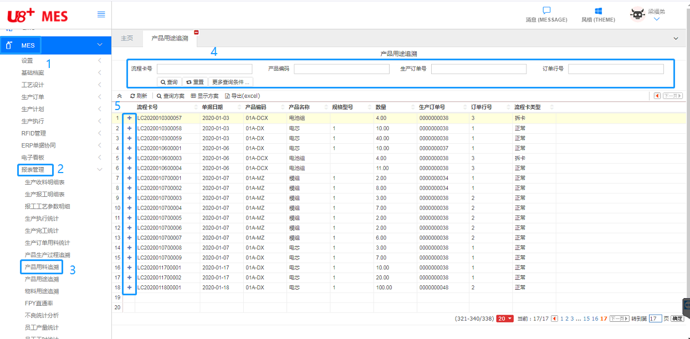

- **操作说明（如上图）**

1. 点击“MES”,点击“报表管理”，点击“产品用途追溯”，进入产品用途追溯页面；

2. 产品用途追溯页面，可以查询流程卡在哪个流程卡上做了收料处理，对应操作是“4”；

3. 产品用途追溯页面，点击展开符号，展开显示产品的用途，对应操作是“5”；

## 1.11 日志管理

### 1.11.1 工序计划推算日志

- **菜单路径**

登录 mes3.0—MES—日志管理—工序计划推算日志

- **概述**

工序计划推算日志，记录每次工序计划推算。

- **操作界面**

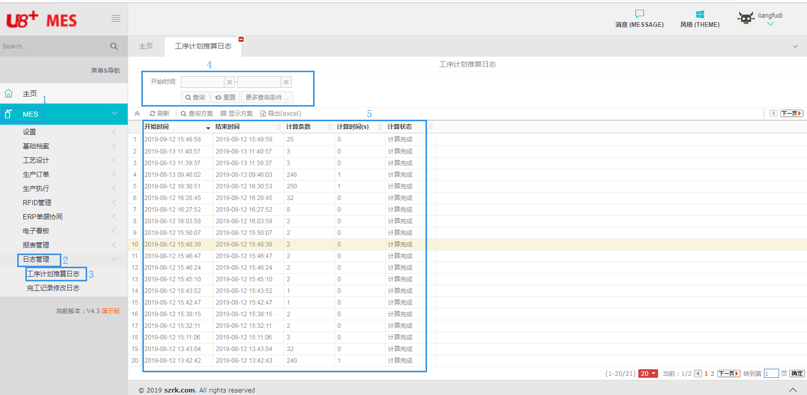

- **操作说明（参照上图）**

1、点击“MES”,点击“日志管理”，点击“工序计划推算日志”，进入工序计划推算日志列表页面；

2、工序计划推算日志列表页，列表记录显示全部的工序计划推算日志，可以查询工序计划推算日志数据，对应操作是“4”；

3、工序计划推算日志列表页，列表显示工序计划推算日志数据，对应操作是“5”。

### 1.11.2 完工记录修改日志

- **菜单路径**

登录 mes3.0—MES—日志管理—完工记录修改日志

- **概述**

完工记录修改日志，记录每次修改完工记录的数据。

- **操作界面**

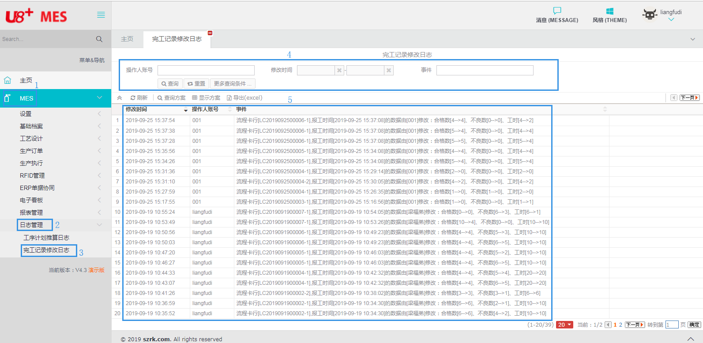

- **操作说明（参照上图）**

1、点击“MES”,点击“日志管理”，点击“完工记录修改日志”，进入完工记录修改日志列表页面；

2、完工记录修改日志列表页，列表记录显示全部的完工记录修改日志，可以查询完工记录修改日志数据，对应操作是“4”；

3、完工记录修改日志列表页，列表显示完工记录修改日志数据，对应操作是“5”。

# 工站

## 收料

- **菜单路径**

登录工站—收料

- **概述**

生产执行过程的收料，收物料准备开工操作。

- **操作界面**

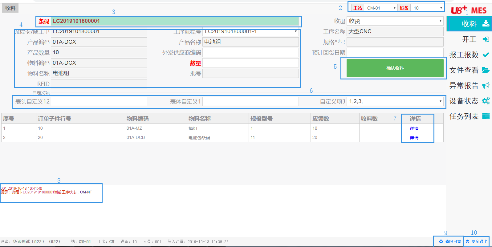

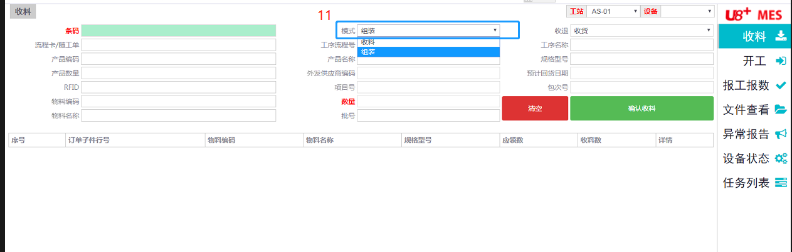

- **操作说明（参照上图）**

1. 登录工站，点击“收料”，进入收料页面，对应操作是“1”；

2. 收料页，选择对应的“工站”和“设备”，对应操作是“2”；

3. 收料页，扫“流程卡号”带出生产订信息，扫“物料条码”带出物料信息，和物料数量，扫码对应操作是“3”，带出的信息对应操作是“4”；

4. 收料页，点击“确认收料”，进行收料保存操作，对应操作是“5”；

5. 收料页，自定义项数据，由 U8 的生产订单带出来，对应操作是“6”；

6. 收料页，表体列表显示收料的数据情况，点击“详情”弹出收的物料详情，对应操作是“7”；

7. 收料页，信息框处记录工站的每个操作显示，对应操作是“8”；

8. 收料页，点击“清除日志”，清除信息框内的日信息，对应操作是“9”；

9. 收料页，点击“安全退出”，退出到工站登录页，对应操作是“10”。

10. 收料页，收料模式选择了“组装”，扫码处可以扫不同物料的流程卡，对应操作是“11”。

## 开工

- **菜单路径**

登录工站—开工

- **概述**

生产执行中的开工操作。

- **操作界面**

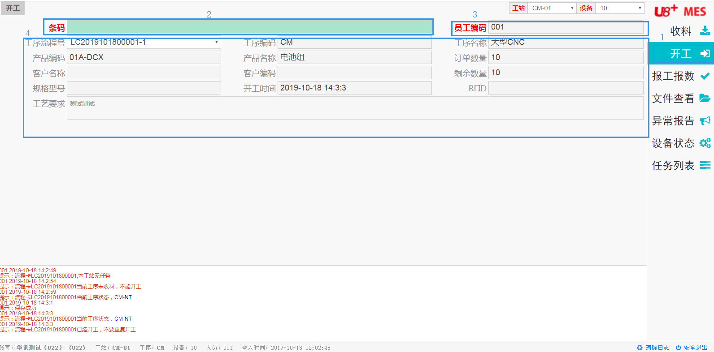

- **操作说明（参照上图）**

1. 登录工站，点击“开工”，进入开工页面，对应操作是“1”；

2. 开工页，扫流程卡，带出生产订单信息，对应操作是“2”；

3. 开工页，扫完流程卡条码后，扫员工编号，进行开工，对应操作是“3”

4. 开工页，显示生产订单信息，对应操作是“4”；

## 报工报数

- **菜单路径**

登录工站—报工报数

- **概述**

生产执行中的报工报数操作。

- **操作界面**

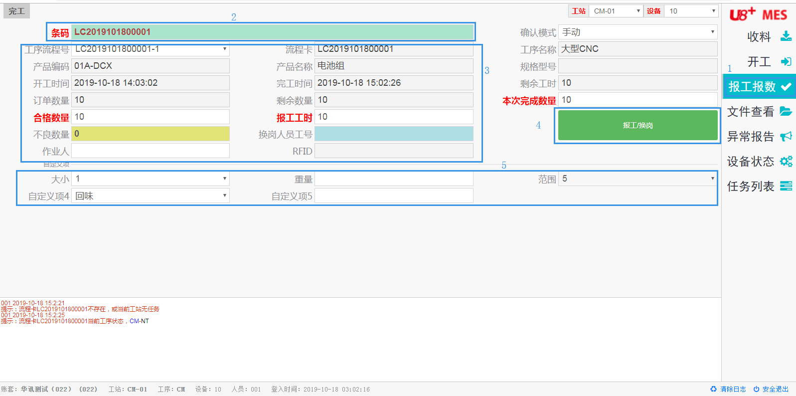

- **操作说明（参照上图）**

1. 登录工站，点击“报工报数”，进入报工报数页面，对应操作是“1”；

2. 报工报数页，扫流程卡带出生产订单报工信息，对应操作是“2”；

3. 报工报数页，扫流程卡信息带出的信息显示，对应操作是“3”；

4. 报工报数页，点击“报工/换岗”，确认报工数量，对应操作是“4”；

5. 报工报数页，自定义项数据油 U8 的生产订单带出数据，对应操作是“5”；

## 文件查看

- **菜单路径**

登录工站—文件查看

- **概述**

根据工序流程卡查询文件内容数据。

- **操作界面**

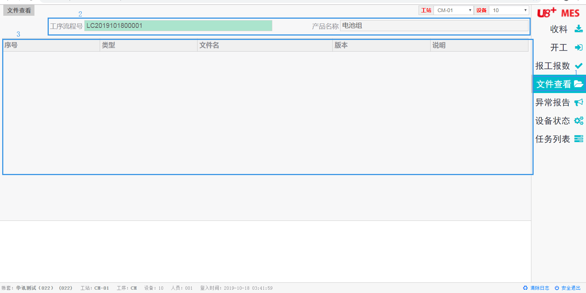

- **操作说明（参照上图）**

1. 登录工站，点击“文件查看”，进入文件查看页面，对应操作是“1”；

2. 文件查看页，扫流程卡带出文件内容查看，对应操作是“2”；

3. 文件查看页，文件内容查看，对应操作是“3”。

## 异常报告

- **菜单路径**

登录工站—异常报告

- **概述**

管理工站异常数据。

- **操作界面**

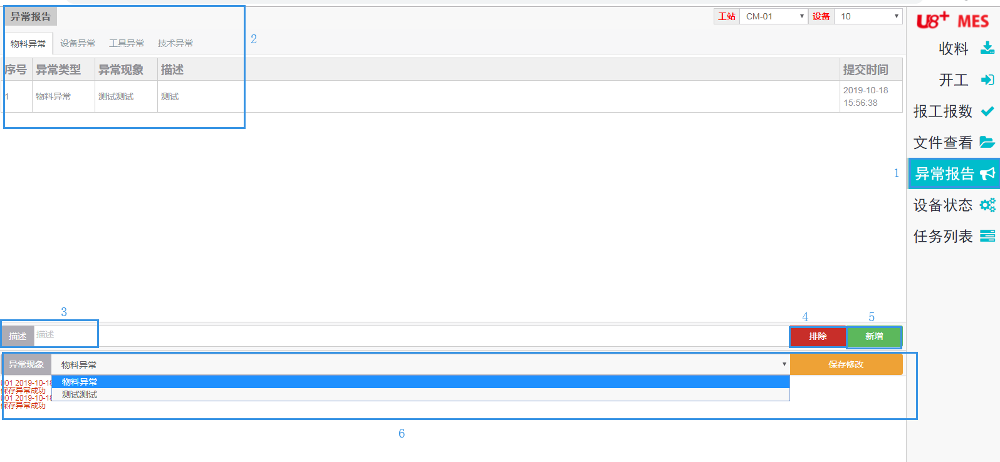

- **操作说明（参照上图）**

1. 登录工站，点击“异常报告”，进入异常报告页面，对应操作是“1”；

2. 异常报告页，输入描述，对应操作是“3”；

3. 异常报告页，选择异常现象，对应操作是“6”；

4. 异常报告页，点击“新增”，新增异常报告，对应操作是“5”；

5. 异常报告页，选择异常报告数据，对应操作是“2”；

6. 异常报告页，选择异常报告数据后，点击“排除”，排除异常报告，对应操作是“4”。

## 设备状态

- **菜单路径**

登录工站—设备状态

- **概述**

显示对应工站下的所以状态的设备。

- **操作界面**

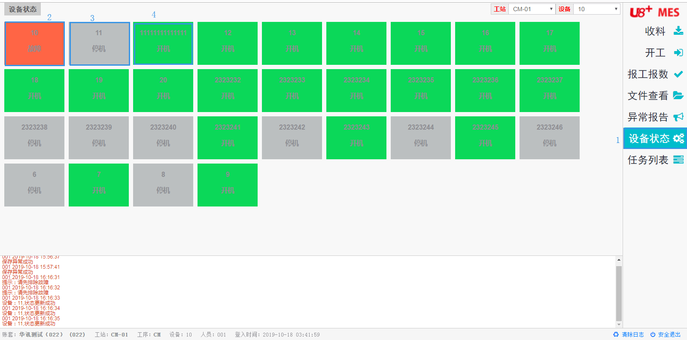

- **操作说明（参照上图）**

1. 登录工站，点击“设备状态”进入设备状态页面，对应操作是“1”；

2. 设备状态页，显示橘色的设备是故障设备，对应操作“2”；

3. 设备状态页，显示灰色的设备是停机设备，点击可开机，对应操作是“3”；

4. 设备状态页，显示绿色的设备是开机设备，点击可停机，对应操作是“4”。

## 任务列表

- **菜单路径**

登录工站—任务列表

- **概述**

查看设备在制任务、工站在制任务、待分配任务和已完成任务的任务数据。

- **操作界面**

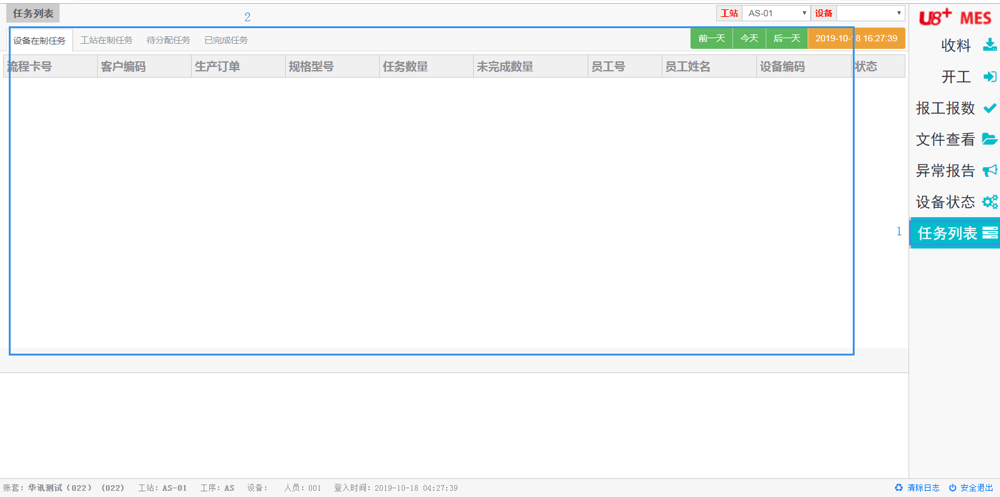

- **操作说明（参照上图）**

1. 登录工站，点击“任务列表”，进入任务列表页，对应操作是“1”；

2. 任务列表页，设备在制任务、工站在制任务、待分配任务和已完成任务的任务数据，对应操作是“2”；
